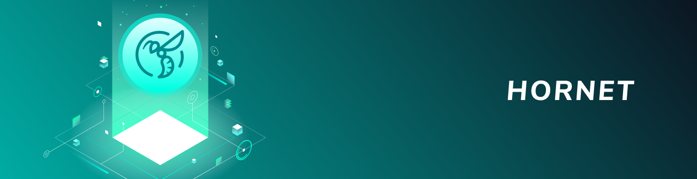

# Node APIs

**IOTA networks consist of interconnected nodes that have read/write access to the Tangle. These nodes come with an API that you can use to connect to attach your own transactions to the Tangle, find existing transactions, and keep track of the balances on addresses.**

:::warning:Legacy documentation
We are developing Chrysalis, the largest update in IOTA history. If you are developing on IOTA, see [Chrysalis documentation](https://chrysalis.docs.iota.org/).
:::

-------------------------

## [IRI](root://hornet/1.1/references/api-reference.md)
Use this API to attach transactions to the Tangle, find the balance of addresses, and find transactions.
-------------------------

-------------------------

## [Chronicle](root://chronicle/1.0/references/chronicle-api-reference.md)
Use the Chronicle API to find historical transactions.
-------------------------

