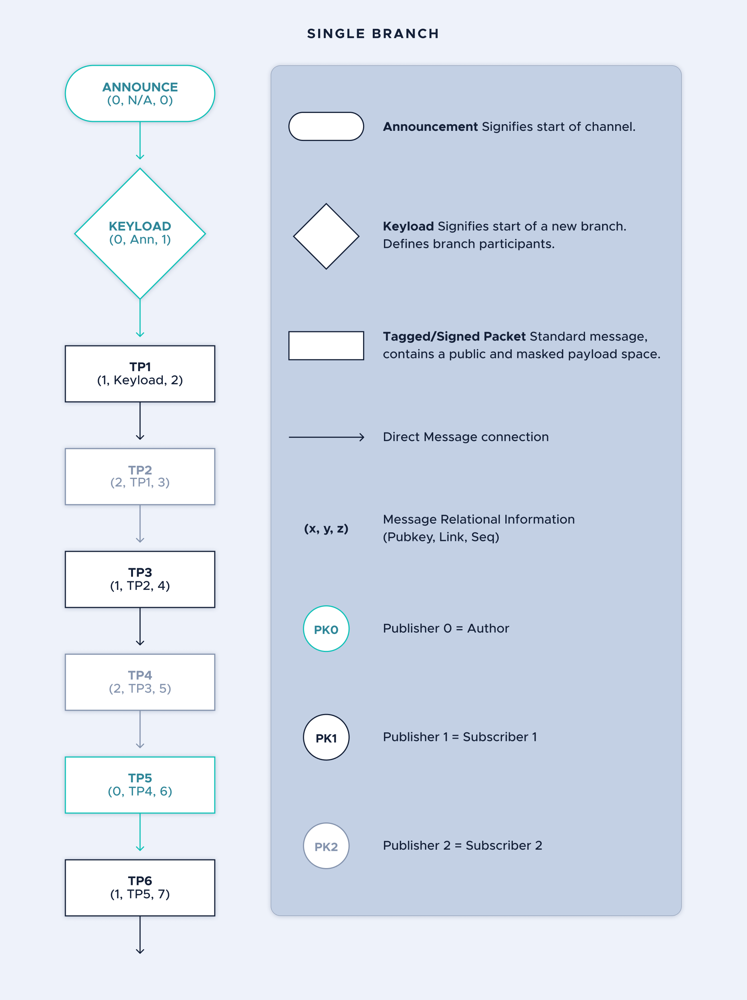

# Sequencing with branches

**As the owner of a channel, the author can choose to create two types of branching configuration. This topic explains these types and helps you chose the one that suits your needs**

Messages generated through the Channels protocol can be attached in a variety of customizable tree shapes that can be either single-branch or multi-branch. Branching refers to the delineation of publisher and listener management within a channel. 

Upon creation of a new channel, a flag indicating which of these two models is to be used must be specified to determine the sequencing model logic that all participants will be configured with after processing the `Announcement`. See [Creating a new channel](../guides/creating-a-new-channel.md).

The customizable nature of these trees can make navigation and key management complicated quickly, especially in a multi-publisher environment. 

| **Workflow** | **Advantages** | **Disadvantages** |
|:----|:-----|:----|:----|
|Single branching| A single linear branch makes reading and writing messages easy and logical | Multiple publishers in a channel will lead to overhead due to conficting "next" messages|
|Multi-branching| Multiple branches allows a channel to have multiple publishers whilest maintaining a chronological order | Maintaining a sequence requires a second message send, and leads to a roundabout reading experience if not properly managed|

:::info:
If you plan to have only 1 publisher (the `Author`) in your channel, multi-branching has no advantage for you. 
:::

## Single branching

In a single branch implementation, all participants post messages to a single branch in a sequential ordering. Each message in the branch will increase the sequence number for the next message regardless of which publisher sends it. 

As each participant processes a message, they will update their [state](../how-it-works.md) and be able to process the following message. Once all messages are processed, all participants will have the same state.

## Multi-branching

In a multi-branch channel, messages are placed into a hierarchy of branches and chains within the message tree. Each branch can contain several chains, attaching to existing messages in a variety of orders and configurations. 

In order to organise these messages, a special sequencing branch is used. Once a new publisher has been established in the channel, the author informs the other participants of the existence of this new publisher, and a new chain of messages is formed for that publisher from the channel sequencing branch. 

In order to navigate complex message graphs, each publisher publishes `Sequence` messages into their chain within the sequencing branch. These `Sequence` messages hold the information required to locate the actual message link from the message branch.

Channel participants keep a mapping of publisher identities and sequence states. Participants will search for these `Sequence` messages iteratively to indicate the presence of a new message from a known  publisher, and fetch that referenced message. 
