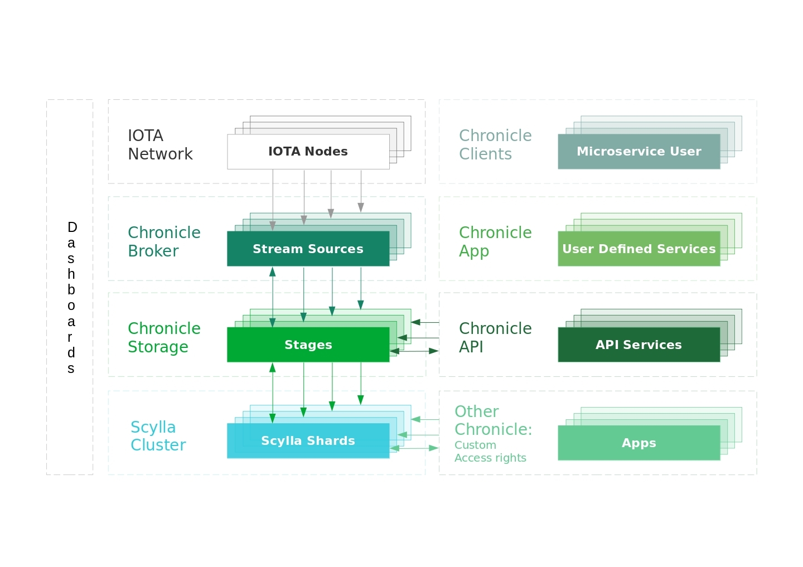

# How Chronicle works

**This topic describes the architecture of Chronicle and how it stores transactions.**

Chronicle is a framework for building permanode services that receive transactions from an IOTA network and store them in a Scylla cluster.

To make Chronicle extensible, it is divided into the following components:

## Dashboard

This component is an application for managing and monitoring components such as adding or removing Scylla nodes without downtime or connecting to new IOTA nodes in the Chronicle Broker.

## Chronicle Broker

This component receives and processes transactions from IOTA nodes through an event API such as MQTT and provides useful utilities to import historical data.

At the moment, Chronicle Broker uses MQTT to receive transactions and persist them, using the shard-aware strategy in Chronicle Storage.

## Chronicle Storage

This component provides access to the datasets and the physical Scylla nodes in a cluster, called a ring.

Chronicle Storage starts by initializing the dashboard and query engine.

The query engine is made up of stages, which handle requests for transactions from each [shard](https://university.scylladb.com/courses/scylla-essentials-overview/lessons/architecture/topic/shard/) in a given Scylla node. The stages are controlled by stage supervisors, which in turn are controlled by node supervisors that maintain the cluster topology.

Each stage includes the following lightweight processors:

Workers represent requests such as from API calls or the MQTT worker.

When a worker receives a request, it sends it to the corresponding reporter of the shard.

The reporter then sends the request to its sender, which handles sending the request to the shard socket.

The receiver then takes the responses from the shard and passes it to reporter who passes it back to the worker to pass onto the client.

To use Chronicle Storage, applications must implement the worker trait and access the local ring to send requests to the corresponding stage.

The ring provides a subset of useful send strategy methods:
- **`send_local_random_replica(token, request)`:** Selects a random stage within the same datacenter
- **`send_global_random_replica(token, request)`:** Selects a random stage in any datacenter

## Next steps

[Try the permanode CLI](tutorials/run-a-permanode.md) to start storing your own transactions.