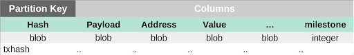
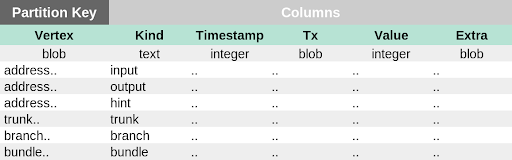
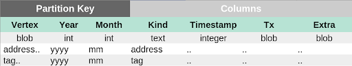

# Scylla data model

**This topic describes the default data model that Chronicle uses.**

The ScyllaDB data model includes the following tables:

- **Transaction:** Stores transactions by their hash

- **Edge:** Provides secondary indexes to look up value transactions by specific fields

- **Data:** Stores zero-value transactions by month

## Transaction table

This table is the single source of truth for transactions. For example, selecting a transaction with a specific hash is done through the transaction table.

The partition key for this table is the transaction hash, which means that transactions are spread evenly across partitions.

## Edge table

This table acts as a way to query value transactions by their fields. For example, selecting an address which has been used as an input or output within a time-range is done through the edge table.

The partition key can be any field such as `address`, `trunkTransaction`, `branchTransaction`, and `bundle`. All the rows with the same partition key are stored in the same partition and replicated across the same nodes.

## Data table

This table acts as a way to query zero-value transactions by their fields.

The schema is almost identical to the edge table, except the partition key is a composite partition key (vertex, year, month).

This table is useful because, unlike value transactions, there may be unbounded zero-value transactions on the same address, which results in an unbounded partition for that address.

