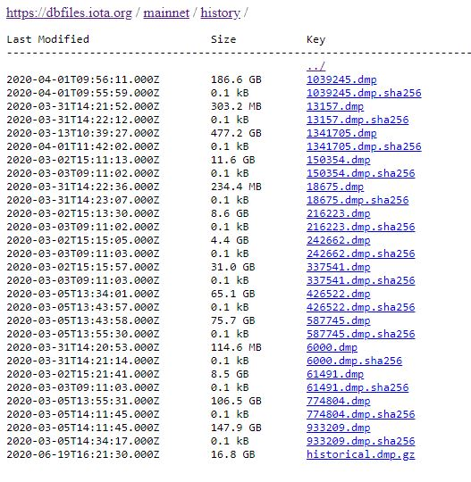

# Run the permanode CLI

**In this tutorial, you use Chronicle's built-in permanode CLI to start storing confirmed Mainnet transactions on a local Scylla node.**

## Prerequisites

To complete this tutorial, you need the following:

- A Linux LTS operating system such as [Ubuntu](https://ubuntu.com/download#download)

- 4 GB RAM

- 64-bit processor

- At least 2 CPU cores

    You can check how many CPU cores your device has, using the following command:

    ```bash
    nproc
    ```

- [Rust](https://www.rust-lang.org/tools/install)

- The `build-essentials`, `pkg-config`, and `libzmq3-dev` packages

    You can use the following command to install these packages:

    ```bash
    sudo apt update && sudo apt install build-essential && sudo apt install pkg-config && sudo apt install -y --no-install-recommends libzmq3-dev
    ```

## Step 1. Set up a Scylla node

You must be connected to at least one Scylla node to start storing transactions.

For the purposes of this tutorial, you can start a local Scylla node in a Docker container.

1. Install Docker

    ```bash
    sudo apt install docker.io
    ```

2. Start a Scylla node

    ```bash
    sudo docker run -p 9042:9042/tcp --name my-node --hostname my-node -d scylladb/scylla
    ```

    This command starts running a Scylla node in a detached Docker container, and exposes port 9042 to your local network so that you can later connect Chronicle to it.

    You should see something like the following:

    ```bash
    Status: Downloaded newer image for scylladb/scylla:latest
    3c3ff0525c9d653a2220ff25b11b7862c4bf998096186964cf52153a662dab8e
    ```

3. Make sure that your node is running

    ```bash
    sudo docker exec -it my-node nodetool status
    ```

    If your node is running, you should see something like the following:

    ```
    Datacenter: datacenter1
    =======================
    Status=Up/Down
    |/ State=Normal/Leaving/Joining/Moving
    --  Address     Load       Tokens       Owns    Host ID                               Rack
    UN  172.17.0.2  79.89 KB   256          ?       a7ce2bb2-c19b-43cd-bd19-4bc0013e3f1f  rack1

    Note: Non-system keyspaces don't have the same replication settings, effective ownership information is meaningless
    ```

4. Make a note of your Scylla node's address, you'll need this to connect Chronicle to your Scylla node

    In the example above, the address is 172.17.0.2.

:::info:
Running Scylla in a Docker container is recommended only for testing purposes.

For production applications, it's best to do the following:
- Install Scylla on a native operating system
- Set up many Scylla nodes so that you can recover data if any of them go down

For more information about Scylla, see the [Scylla documentation](https://www.scylladb.com).
:::

## Step 2. (Optional) Download historical transactions

By default, Chronicle starts storing transactions from the moment it starts running. If you want to load historical transactions into your Scylla node, you need to download them from the IOTA Foundation's archive before starting Chronicle.

1. Go to the [archive](https://dbfiles.iota.org/?prefix=mainnet/history/).

    This archive contains historical transactions in `.dmp` files. The number in the filename is the [entry point milestone](root://getting-started/1.0/references/glossary.md#entry-point-milestone). The smaller this number, the older the transactions.

    

2. Click the download link for one of the `.dmp` files

    :::warning:
    Chronicle does not support the `historical.dmp.gz` file.
    :::

3. Make a note of where you extracted the files. You'll need this path in the next step.

## Step 3. Install and configure Chronicle

In this step, you download Chronicle from GitHub and configure it to connect to your local Scylla node.

1. Clone the repository and change into the `chronicle.rs` directory

    ```bash
    git clone https://github.com/iotaledger/chronicle.rs.git
    cd chronicle.rs
    ```

2. Open the configuration file

    ```bash
    sudo nano examples/permanode/config.toml
    ```

3. Add the IP address of your Scylla node to the `addresses` field followed by the CQL port (9042)

    ```bash
    addresses["IP:9042"]
    ```

4. If you downloaded historical transactions from the archive, add the path to your files in the `files` field, followed by the number in the filename

    For example, for a file called 6000.dmp, you would add the following:

    ```bash
    files = [["./path/to/file/6000.dmp", 6000]]
    ```

5. If your device has more than 2 CPU cores and you want to use them, increment the `core_threads` field

## Step 4. Run the permanode CLI

In this step, you run the permanode CLI and examine the logs to make sure that it is receiving and storing transactions. Replace the `$CONFIGPATH` placeholder with the path to your `config.toml` file.


```bash
cd examples
cargo run --release --example permanode $CONFIGPATH/config.toml
```

:::info:
The first time that you execute this command, it may take a few minutes for Rust to compile the code.
:::

When the compilation is finished, you should see something like the following:

```bash
Welcome to Chronicle Permanode Alpha v0.1.0
just exposed stage reporters of shard: 0, to node supervisor
Dashboard: AddNode: Ok(172.17.0.2:9042)
just exposed stage reporters of shard: 1, to node supervisor
address: 172.17.0.2:9042, shard_id: 0, reporter_id: 0, received new session: 1
address: 172.17.0.2:9042, shard_id: 0, reporter_id: 1, received new session: 1
address: 172.17.0.2:9042, shard_id: 0, reporter_id: 2, received new session: 1
address: 172.17.0.2:9042, shard_id: 1, reporter_id: 0, received new session: 1
address: 172.17.0.2:9042, shard_id: 1, reporter_id: 2, received new session: 1
address: 172.17.0.2:9042, shard_id: 1, reporter_id: 1, received new session: 1
Dashboard: Built Ring: true
AppStatus: storage is Running, and got registered
AppStatus: api is Running, and got registered
AppStatus: broker is Running, and got registered
```

Chronicle is now receiving transactions from the IOTA node's in your broker configuration settings.

If you ever want to stop Chronicle, press **Ctrl**+**C**.

To check that Chronicle is storing transactions see the next step for sending an API request.

## Step 5. Test the API

In this step, you use the API to query your Scylla node for the transactions that it has stored.

To complete this step, you need to have [cURL](https://curl.haxx.se/) installed on your device.

1. Go to [utils.iota.org](https://utils.iota.org/) and copy the transaction hash of a recent transaction to your clipboard

    :::info:
    Chronicle will not have the transactions from different networks in its database. Therefore, make sure to copy a transaction hash from the correct network. For example, if Chronicle is connected to nodes on the Mainnet, copy a transactions hash from the Mainnet. 
    :::

2. Paste your transaction hash into the `hashes` array and use the following code snippet to send a request to the `getTrytes` endpoint

    ```bash
    curl http://localhost:4000/api \
    -X POST \
    -H 'Content-Type: application/json' \
    -H 'X-IOTA-API-Version: 1' \
    -d '{
    "command": "getTrytes",
    "hashes": [""]
    }'
    ```

You should see something like the following:

```json
{
"trytes":["BCDDPCADADXCBDVCEAKDXCHDWCEARBYBACXBOBCCEAHDXCDDGDTC9DTCRCHDQAEAHDWCPCBDZCEAMDCDIDEAUCCDFDEAIDGDXCBDVCEARBYBACXBOBCCEADD9DPCMDQCCDCDZCJ9MBCDIDBDHDDBEAVABBCBZAXACBJ9CCXCADTCGDHDPCADDDDBEAWAUAWAUARAUA9BRAWAZACCUACBDBZAXADBWAUAICJ9VCCCCCKBEAHDCDCDZCEAVASACBVA9BGDEAMASCTCDDHDWCGBVANA99999999999999999999999999999999999999999999999999999999999999999999999999999999999999999999999999999999999999999999999999999999999999999999999999999999999999999999999999999999999999999999999999999999999999999999999999999999999999999999999999999999999999999999999999999999999999999999999999999999999999999999999999999999999999999999999999999999999999999999999999999999999999999999999999999999999999999999999999999999999999999999999999999999999999999999999999999999999999999999999999999999999999999999999999999999999999999999999999999999999999999999999999999999999999999999999999999999999999999999999999999999999999999999999999999999999999999999999999999999999999999999999999999999999999999999999999999999999999999999999999999999999999999999999999999999999999999999999999999999999999999999999999999999999999999999999999999999999999999999999999999999999999999999999999999999999999999999999999999999999999999999999999999999999999999999999999999999999999999999999999999999999999999999999999999999999999999999999999999999999999999999999999999999999999999999999999999999999999999999999999999999999999999999999999999999999999999999999999999999999999999999999999999999999999999999999999999999999999999999999999999999999999999999999999999999999999999999999999999999999999999999999999999999999999999999999999999999999999999999999999999999999999999999999999999999999999999999999999999999999999999999999999999999999999999999999999999999999999999999999999999999999999999999999999999999999999999999999999999999999999999999999999999999999999999999999999999999999999999999999999999999999999999999999999999999999999999999999999999999999999999999999999999999999999999999999999999999999999999999999999999999999999999999999999999999999999999999999999999999999999999999999999999999999999999999999999999999999999999999999999999999999999999999999999999999999999999999999999999999999999999999999999999999999999999999999999999999999HORNET99INTEGRATED99SPAMMER9999999999999999999999999999999999999999999999999RAJIV999999999999999999999999999HORNET99SPAM99RAJIV9999IPZZNHURACD99999999999999999999WPEHMEK9QNNRXVTKQQUUZLREUYNIMUNFQXNIQBX9AGPPSCR99GACMAGXLPXVJXPIGBUFRTRXNLYOYBW9XNJLWELEHNVTWUKIGCJ9YWDNNABOJJPCZTYP9GRGGCJB9ZCJ9NPMWVETCIMTAKWAOK9LJSWVKJBEI99999NJLWELEHNVTWUKIGCJ9YWDNNABOJJPCZTYP9GRGGCJB9ZCJ9NPMWVETCIMTAKWAOK9LJSWVKJBEI99999HORNET99SPAM99RAJIV9999IPZZGHCVK9HQF999999999K99999999CI99999999LCWB9999999999999"]
}
```

:::success: Congratulations :tada:
You now have a Chronicle permanode that is saving all new and confirmed transaction in the Tangle to your Scylla node.
:::

## Troubleshooting

These are known issues that you may find while following this tutorial and some suggested steps to resolve them.

### linker cc not found

You may see this error after executing the `cargo run` command.

To fix this error, [make sure you have the `build-essentials` installed](#prerequisites).

### failed to run custom build command for zmq-sys v0.11.0

You may see this error after executing the `cargo run` command.

To fix this error, [make sure you have the `libzmq3-dev` installed](#prerequisites).

### failed to create keyspace

You may see this error after executing the `cargo run` command.

To fix this error, try running the command again.

### failed to add nodes

You may see this error after executing the `cargo run` command.

This error suggests that your Scylla node may not be running or it may not be exposed to your local network.

To confirm that your Scylla node is running and that it is exposed to your local network, open a CQL shell:

```bash
docker exec -it my-node cqlsh
```

You should see something like the following:

```bash
Connected to  at 172.17.0.2:9042.
[cqlsh 5.0.1 | Cassandra 3.0.8 | CQL spec 3.3.1 | Native protocol v4]
Use HELP for help.
cqlsh>
```

Enter `exit` to leave this shell.

If you cannot connect to the shell, stop your Scylla node and restart it, using the following command:

```bash
sudo docker stop /my-node
sudo docker rm /my-node
sudo docker run -p 9042:9042/tcp --name my-node --hostname my-node -d scylladb/scylla
```

## Next steps

If you're interested in contributing to the project, find out [how you can contribute](../contribute.md).

To convert the returned transaction trytes to a readable object, see the [asTransactionTrytes()](https://github.com/iotaledger/iota.js/tree/next/packages/transaction-converter#module_transaction-converter.asTransactionObject) method.


