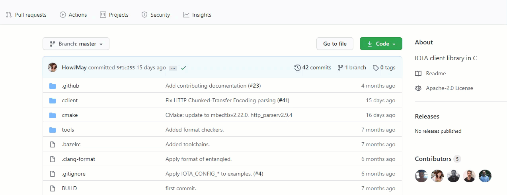

# C quickstart

**In this quickstart, you learn the basics of IOTA development in C, from setting up a development environment to connecting to a node.**

In this quickstart, you will learn how to:

1. Set up a developer environment

2. Install a library

3. Connect to a node

## Step 1. Set up a developer environment

To use a C client library, you need a set of programming tools, which make up a development environment.

Throughout this documentation, we use a Linux [Ubuntu 18.04 LTS](https://www.ubuntu.com/download/server) operating system. If you are on a Windows or macOS, you can try to run these examples on your operating system, or you can [create a Linux server in a virtual machine](root://general/0.1/how-to-guides/set-up-virtual-machine.md).

1. [Install the Bazel build tool](https://docs.bazel.build/versions/master/install.html)

    This tool is used to build and compile your C code into machine code.

    If you're new to Bazel, we recommend reading the [Bazel documentation](https://docs.bazel.build/versions/master/getting-started.html).

2. Install Git

    ```bash
    sudo apt install git
    ```

    Git is used to download the library and its dependencies from GitHub.

3. Create a directory for your project

	```bash
	sudo mkdir my-c-iota-project
    cd my-c-iota-project
	```

Now you're ready to start installing packages.

## Step 2. Install a library

In this step, you install the core client library, which allows you to connect to an IOTA node.

1. In the `my-c-iota-project` directory, create a file called `WORKSPACE`

    ```bash
    sudo nano WORKSPACE
    ```

2. Add the following content to load the library's dependencies:

    Replace the `$CCLIENT_COMMIT_HASH` placeholder with the latest Git commit hash of the `master` branch in the [`iota.c` repository](https://github.com/iotaledger/iota.c).

    

    Replace the `$COMMON_COMMIT_HASH` placeholder with the latest Git commit hash of the `master` branch in the [`iota_common` repository](https://github.com/iotaledger/iota_common).

    Replace the `$RULES_IOTA_COMMIT_HASH` placeholder with the latest Git commit hash of the `master` branch in the [`rules_iota` repository](https://github.com/iotaledger/rules_iota). 

    ```bash
    load("@bazel_tools//tools/build_defs/repo:git.bzl", "git_repository", "new_git_repository")

    git_repository(
    name = "org_iota_common",
    commit = "$COMMON_COMMIT_HASH",
        remote = "https://github.com/iotaledger/iota_common.git",
    )

    git_repository(
        name = "cclient",
        commit = "$CCLIENT_COMMIT_HASH",
        remote = "https://github.com/iotaledger/iota.c.git",
    )

    # external library build rules
    git_repository(
        name = "rules_iota",
        commit = "$RULES_IOTA_COMMIT_HASH",
        remote = "https://github.com/iotaledger/rules_iota.git",
    )

    load("@rules_iota//:defs.bzl", "iota_deps")

    iota_deps()
    ```

Now you're ready to write your own code to connect to a node.

## Step 3. Connect to a node

In this step, you write the code that will connect to a node and call its `getNodeInfo` endpoint.

1. Create an `examples` directory in which to store your application code

    ```bash
    sudo mkdir examples
    cd examples
    ```

    Now your directory structure should look like the following:

    ```bash
    |-- WORKSPACE
    |-- examples
    ```

2. In the `examples` directory, create a `config.h` file with your global configuration settings for your application

    ```cpp
    // The IOTA node to connect to and its API port
    // This node is a Devnet node
    #define CONFIG_IRI_NODE_URI "nodes.devnet.iota.org"
    #define CONFIG_IRI_NODE_PORT 443

    // Whether your node has HTTPS enabled
    #define CONFIG_ENABLE_HTTPS

    // If your node has HTTPS enabled, this constant defines your certificate
    #define TLS_CERTIFICATE_PEM \
            "-----BEGIN CERTIFICATE-----\r\n" \
            "MIIDQTCCAimgAwIBAgITBmyfz5m/jAo54vB4ikPmljZbyjANBgkqhkiG9w0BAQsF\r\n" \
            "ADA5MQswCQYDVQQGEwJVUzEPMA0GA1UEChMGQW1hem9uMRkwFwYDVQQDExBBbWF6\r\n" \
            "b24gUm9vdCBDQSAxMB4XDTE1MDUyNjAwMDAwMFoXDTM4MDExNzAwMDAwMFowOTEL\r\n" \
            "MAkGA1UEBhMCVVMxDzANBgNVBAoTBkFtYXpvbjEZMBcGA1UEAxMQQW1hem9uIFJv\r\n" \
            "b3QgQ0EgMTCCASIwDQYJKoZIhvcNAQEBBQADggEPADCCAQoCggEBALJ4gHHKeNXj\r\n" \
            "ca9HgFB0fW7Y14h29Jlo91ghYPl0hAEvrAIthtOgQ3pOsqTQNroBvo3bSMgHFzZM\r\n" \
            "9O6II8c+6zf1tRn4SWiw3te5djgdYZ6k/oI2peVKVuRF4fn9tBb6dNqcmzU5L/qw\r\n" \
            "IFAGbHrQgLKm+a/sRxmPUDgH3KKHOVj4utWp+UhnMJbulHheb4mjUcAwhmahRWa6\r\n" \
            "VOujw5H5SNz/0egwLX0tdHA114gk957EWW67c4cX8jJGKLhD+rcdqsq08p8kDi1L\r\n" \
            "93FcXmn/6pUCyziKrlA4b9v7LWIbxcceVOF34GfID5yHI9Y/QCB/IIDEgEw+OyQm\r\n" \
            "jgSubJrIqg0CAwEAAaNCMEAwDwYDVR0TAQH/BAUwAwEB/zAOBgNVHQ8BAf8EBAMC\r\n" \
            "AYYwHQYDVR0OBBYEFIQYzIU07LwMlJQuCFmcx7IQTgoIMA0GCSqGSIb3DQEBCwUA\r\n" \
            "A4IBAQCY8jdaQZChGsV2USggNiMOruYou6r4lK5IpDB/G/wkjUu0yKGX9rbxenDI\r\n" \
            "U5PMCCjjmCXPI6T53iHTfIUJrU6adTrCC2qJeHZERxhlbI1Bjjt/msv0tadQ1wUs\r\n" \
            "N+gDS63pYaACbvXy8MWy7Vu33PqUXHeeE6V/Uq2V8viTO96LXFvKWlJbYK8U90vv\r\n" \
            "o/ufQJVtMVT8QtPHRh8jrdkPSHCa2XV4cdFyQzR1bldZwgJcJmApzyMZFo6IQ6XU\r\n" \
            "5MsI+yMRQ+hDKXJioaldXgjUkK642M4UwtBV8ob2xJNDd2ZhwLnoQdeXeGADbkpy\r\n" \
            "rqXRfboQnoZsG4q5WTP468SQvvG5\r\n" \
            "-----END CERTIFICATE-----\r\n"

    #define DEPTH 3

    // The minimum weight magnitude for the Devnet (for the Mainnet use 14)
    #define MINIMUM_WEIGHT_MAGNITUDE 9

    // The security level to use for your addresses
    #define SECURITY_LEVEL 2
    ```

    Now your directory structure should look like the following:

    ```bash
    |-- WORKSPACE
    |-- examples
        |-- config.h
    ```

3. In the `examples` directory, create a `hello_world.c` file and add the following to call its `geNodeInfo` endpoint:

    ```cpp
    #include "cclient/api/core/core_api.h"
    #include "cclient/api/extended/extended_api.h"

    #include <inttypes.h>
    #include "config.h"

    retcode_t get_iota_node_info(iota_client_service_t *iota_client_service, get_node_info_res_t *node_response) {
        retcode_t ret = RC_ERROR;

        // Connect to the node
        ret = iota_client_get_node_info(iota_client_service, node_response);

        // Define variables to determine whether trit conversion succeeds
        trit_t trytes_out[NUM_TRYTES_HASH + 1];
        size_t trits_count = 0;

        // If the node returned data, print it to the console
        if (ret == RC_OK) {
            printf("appName %s \n", node_response->app_name->data);
            printf("appVersion %s \n", node_response->app_version->data);

            // Convert the returned trits to trytes
            // For more information about trits and trytes, see the IOTA documentation portal: https://docs.iota.org/docs/getting-started/0.1/introduction/ternary
            trits_count = flex_trits_to_trytes(trytes_out, NUM_TRYTES_HASH,
                                            node_response->latest_milestone, NUM_TRITS_HASH,
                                            NUM_TRITS_HASH);
            if (trits_count == 0) {
                printf("Failed to convert trits to trytes\n");
                goto done;
            }

            // Empty this string. It's not needed anymore
            trytes_out[NUM_TRYTES_HASH] = '\0';

            // Print the results to the console
            printf("latestMilestone %s \n", trytes_out);
            printf("latestMilestoneIndex %u\n", (uint32_t) node_response->latest_milestone_index);
            printf("latestSolidSubtangleMilestoneIndex %u\n", (uint32_t)
            node_response->latest_solid_subtangle_milestone_index);

            printf("milestoneStartIndex %u\n", node_response->milestone_start_index);
            printf("neighbors %d \n", node_response->neighbors);
            printf("packetsQueueSize %d \n", node_response->packets_queue_size);
            printf("tips %u \n", node_response->tips);
            printf("transactionsToRequest %u\n", node_response->transactions_to_request);
            printf("features: ");
            size_t num_features = get_node_info_req_features_num(node_response);
            for (; num_features > 0; num_features--) {
            printf("%s, ", get_node_info_res_features_at(node_response, num_features - 1));
            printf("\n");
            }
        } else {
            printf("Failed to connect to the node.");
        }

        done:

        // Free the response object
        get_node_info_res_free(&node_response);
        return ret;
    }

    int main(void) {
        iota_client_service_t *iota_client_service;

    #ifdef CONFIG_ENABLE_HTTPS
        iota_client_service = iota_client_core_init(CONFIG_IRI_NODE_URI, CONFIG_IRI_NODE_PORT, TLS_CERTIFICATE_PEM);
    #else
        iota_client_service = iota_client_core_init(CONFIG_IRI_NODE_URI, CONFIG_IRI_NODE_PORT, NULL);
    #endif
        // Allocate a response object
        get_node_info_res_t *node_response = get_node_info_res_new();
        // Call the getNodeInfo endpoint
        get_iota_node_info(iota_client_service, node_response);
    }
    ```

    Now your directory structure should look like the following:

    ```bash
    |-- WORKSPACE
    |-- examples
        |-- config.h
        |-- hello_world.c
    ```

4. In the `examples` directory, create a `BUILD` file and add the following:

    ```bash
    package(default_visibility = ["//visibility:public"])

    cc_binary(
        name = "hello_world",
        srcs = ["hello_world.c", "config.h",],
        copts = ["-DLOGGER_ENABLE"],
        linkopts = ["-pthread"],
        deps = ["@cclient//cclient/api",],
        visibility = ["//visibility:public"],
    )
    ```

    This code creates the rules for building and compiling your `hello_world.c` file.

Now your directory structure should look like the following:

```bash
|-- WORKSPACE
|-- examples
    |-- BUILD
    |-- config.h
    |-- hello_world.c
```

## Step 4. Run the code

It's best practice to make sure that you're connected to a synchronized node before you start sending transactions to it. This way, you know that it has an up-to-date view of the Tangle.

In this step, you run the code and check if it is synchronized.

1. Go to the IOTA Foundation [Discord](https://discord.iota.org) and enter **!milestone** in the `botbox` channel

    

    The Discord bot should return the current `latestMilestoneIndex` field from a [node quorum](root://getting-started/1.1/references/glossary.md#node-quorum).

2. Run your `hello_world.c` file

    ```bash
    bazel run -c opt examples:hello_world
    ```

The node returns something like the following:

``` 
appName HORNET
appVersion 0.4.0
latestMilestone 9SF9HY9ZSTGSK9ZSHPCLPPFWZFVWEYRUKYU9TEEZMPZAFJUWQRUBUIVXHOOCTXYYISNVVWLUFYNCIP999
latestMilestoneIndex 1670581
latestSolidSubtangleMilestoneIndex 1670581
milestoneStartIndex 1651535
neighbors 3
packetsQueueSize 0
tips 0
transactionsToRequest 0
features: RemotePOW,
```

If the `latestMilestoneIndex` field is equal to the one you got from Discord and the `latestSolidSubtangleMilestoneIndex` field, the node is synchronized.

If not, try connecting to a different node. The [iota.dance website](https://iota.dance/) includes a list of Mainnet nodes. Or, you can [run your own node](root://node-software/1.0/overview.md).

:::info:
In the `features` list, you can see that this node also support [remote proof of work](root://getting-started/1.1/references/glossary.md#remote-proof-of-work) (RemotePOW). As a result, you can use this node to do proof of work instead of doing it on your local device.

For more information about these fields, see the [node API reference](root://hornet/1.1/references/api-reference.md#getNodeInfo).
:::

:::success: Congratulations :tada:
You've confirmed your connection to a synchronized node.
:::

## Get involved

[Join our Discord channel](https://discord.iota.org) where you can:

- Take part in discussions with IOTA developers and the community
- Ask for help
- Share your knowledge to help others

We have many channels, including the following:

- `-dev`: These channels are read-only and are where developers discuss topics with each other and where you can see any code updates from GitHub.

- `-discussion`: These channels are where you can participate.

## Next steps

Continue learning with our [core C workshop](root://core/1.0/getting-started/get-started-c.md).

