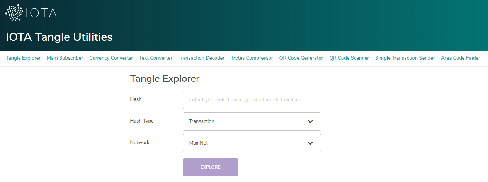

# Deploy some local Tangle utilities

**In this tutorial, you configure a local version of the [IOTA utilities website](https://utils.iota.org/) to use for a private Tangle that has been set up, using the one-command Tangle tutorial. This website has many utilities, for example attaching transactions to your private Tangle, compressing transaction trytes, and converting the value of IOTA tokens into different currencies.**



:::info:
If you set up your private Tangle, using the Hornet plugin or if you built Compass from source, see the [deployment instructions](https://github.com/iotaledger/tangle-utils-website/blob/master/api/DEPLOYMENT.md) on Github.
:::

## Prerequisites

To complete this tutorial, you need a [one-command Tangle](../tutorials/set-up-one-command.md).

Depending on the utilities you want to use, you need the following configuration credentials:

- For the [Tangle explorer](https://utils.iota.org/), you need [Amazon DynamoDB credentials](https://aws.amazon.com/dynamodb/)

- For the [currency converter](https://utils.iota.org/currency-conversion), you need a [Fixer API key](https://rapidapi.com/fixer/api/fixer-currency) and a [CoinMarketCap API key](https://coinmarketcap.com/api/)

- For the [IOTA area codes map](https://utils.iota.org/area-codes), you need a [Google Maps API key](https://developers.google.com/maps/documentation/javascript/get-api-key)

---

1. Add your configuration credentials to the files in the `/config/tools/` directory. The Amazon Dynamo DB credentials, the Fixer API key, and the CoinMarketCap API key go in the `/config/tools/tools-api-config.json` file. The Google Maps API key goes in the `/config/tools/tools-config.json` file.

2. Execute the `docker-compose up` command with your configuration credentials

    ```bash
    docker-compose -f docker-compose.yml -f docker-compose-tools.yml up
    ```

3. In a web browser, go to `http://localhost:4001` to open your Tangle utilities website.

:::success:
You've got a local set of utilities that you can use to work with your private Tangle.
:::