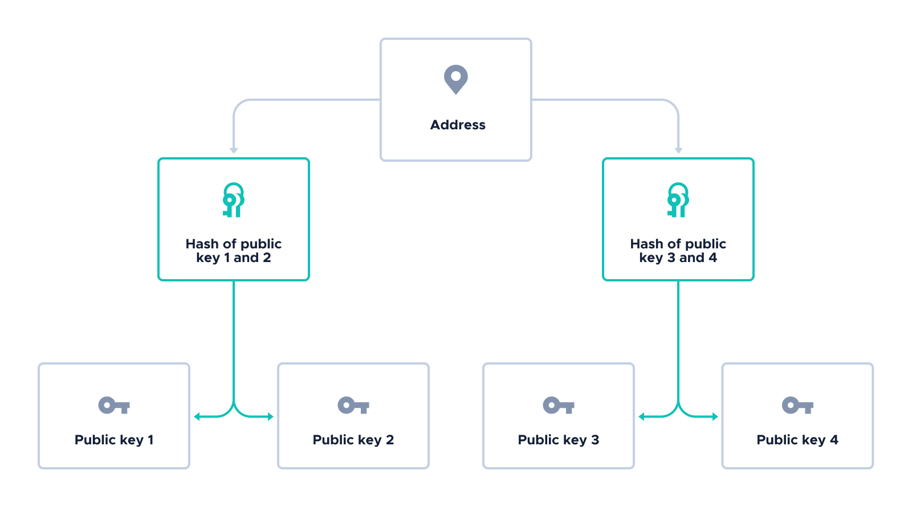

# How Merkle root addresses are generated

**This topic explains the cryptography involved in generating Merkle root addresses.**

A Merkle root address is the root of a Merkle tree.

To generate the Merkle tree, first a number of addresses are generated from a seed, using the process described in [How addresses are generated](../cryptography/addresses.md). 

:::info:
Because these addresses don't appear in transactions, they are referred to as public keys in the rest of this topic.
:::

The total number of public keys that are generated depends on the depth of the Merkle tree in this formula:

2depth

The more public keys in a Merkle tree, the more corresponding private keys, meaning that more bundle hashes can be signed to prove ownership of the Merkle root address.

For example, for a depth of 2, the Merkle tree will have 4 public keys. As a result, 4 bundle hashes could be signed to prove ownership of the Merkle root address.

 

To allow nodes to verify a transaction's signature where the address is the Merkle root, the bundle must contain the following:

- Enough zero-value transactions to contain the fragmented signature
- One transaction whose `signatureMessageFragment` field contains enough missing data from the Merkle tree to allow the node to rebuild the Merkle root

If the rebuilt Merkle root is the same as the transaction's address, the signature is valid.

For example, a node receives a transaction that was signed with the private key of public key 1.

First, the node [verifies the signature](../cryptography/signatures.md#verifying-a-w-ots) to find out public key 1.

Then, the node looks at the rest of the bundle for the following:

- Public key 2
- The hash of public key 3 and 4

Using this information, the node hashes public keys 1 and 2. Then, the node hashes that hash along with the hash of public key 3 and 4 to find the Merkle root.

If the Merkle root is the same as the transaction's address, the signature is valid.

## Next steps

[Learn how checksums are generated](../cryptography/checksums.md).