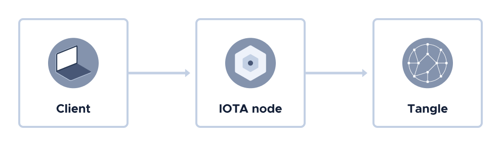

# Architecture overview

**This topic give you a high-level overview of the architecture in IOTA.**

The IOTA architecture involves the following components:

- **Nodes:** Interconnected devices that are responsible for ensuring the integrity of the Tangle. These devices make up an IOTA network.

- **The Tangle:** A public ledger that's replicated across all nodes in an IOTA network. All data in the Tangle is stored in objects called transactions. When a transaction is attached to the Tangle, it cannot be changed: It's immutable.

- **Clients:** Users of an IOTA network who send transactions to nodes to be attached to the Tangle.

## Next steps

Get some experience with the Tangle by [setting up the developer tools](../first-steps/set-up-env.md) you need to send transactions.

