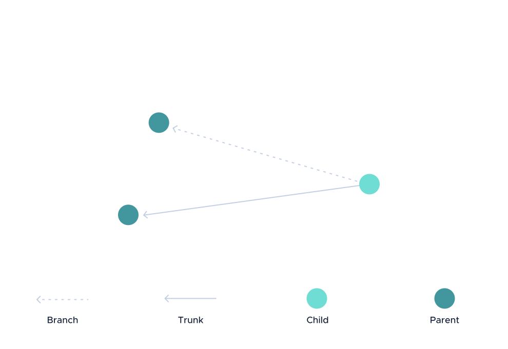
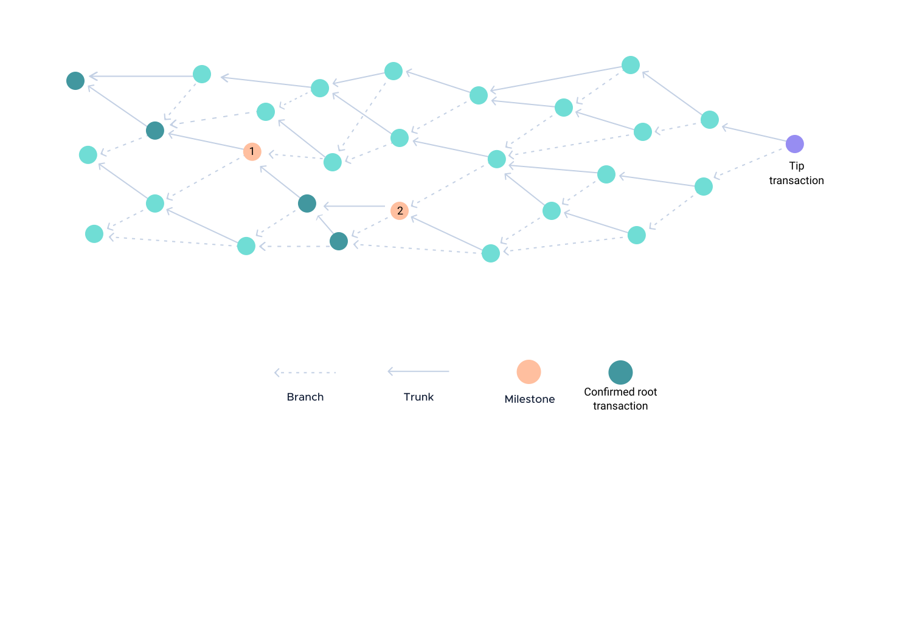
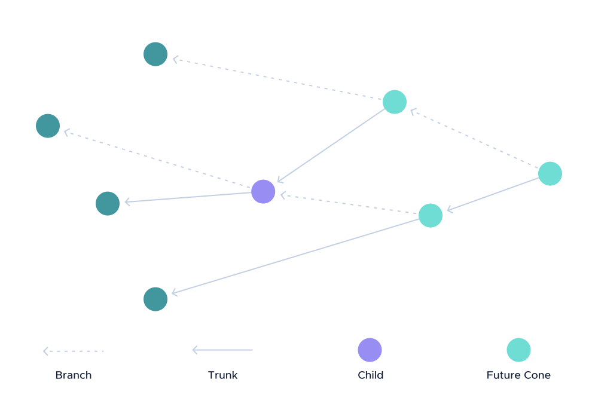

# Terminology

**This termbase contains definitions of terms that are used in IOTA.**

In the interests of efficient and accurate translations, we do not use synonyms. Instead, terms have one of the following statuses:

- **Preferred:** This term is used in our documentation
- **Deprecated:** This term is banned, out-of-date, or obsolete

## Clients

The terms in this category are related to clients on an IOTA network

### address

|**Definition**|**Part of speech**|**Status**|
|:---------|:-------------|:-----|
|A public key that belongs to a seed and that has a balance of [IOTA tokens](#iota-token) on IOTA networks|noun|preferred|

See also: [IOTA accounts](../accounts/overview.md)

### faucet

|**Definition**|**Part of speech**|**Status**|
|:---------|:-------------|:-----|
|A tool that transfers [IOTA tokens](#iota-token) to a given [address](#address)|noun|preferred|

See also: [Available faucets](../references/faucets.md)

### private key

|**Definition**|**Part of speech**|**Status**|
|:---------|:-------------|:-----|
|A secret key that is derived from a seed and can be used to prove ownership of an address or a message in a transaction|noun|preferred|

### spent address

|**Definition**|**Part of speech**|**Status**|
|:---------|:-------------|:-----|
|An address that has already been withdrawn from in a signed input transaction in the Tangle and that is unsafe to withdraw from again|noun|preferred|

See also: [IOTA accounts](../accounts/overview.md)

### security level

|**Definition**|**Part of speech**|**Status**|
|:---------|:-------------|:-----|
|Parameter that affects the security of one-time signatures|noun|preferred|

### seed

|**Definition**|**Part of speech**|**Status**|
|:---------|:-------------|:-----|
|Unique password that is used to generate [addresses](#address), [private keys](#private-key), and signatures|noun|preferred|

See also: [IOTA accounts](../accounts/overview.md)

### wallet

|**Definition**|**Part of speech**|**Status**|
|:---------|:-------------|:-----|
|Application for managing [addresses](#address) and [private keys](#private-key)|noun|preferred|

See also: [Wallets](../accounts/wallets.md)

## Cryptography

The terms in this category are related to cryptography

### Curl

|**Definition**|**Part of speech**|**Status**|
|:---------|:-------------|:-----|
|Hashing algorithm, designed for the Internet of things, that uses the SHA-3 sponge-based construction|noun|preferred|

See also: [Immutability in the Tangle](../the-tangle/immutability.md), [How proof of work is calculated](../cryptography/proof-of-work.md)

### Kerl

|**Definition**|**Part of speech**|**Status**|
|:---------|:-------------|:-----|
|Ternary version of the Keccek-384 hashing algorithm that takes a 48 byte input and produces a 243 trit output, using two's complement|noun|preferred|

See also: [Kerl GitHub repository](https://github.com/iotaledger/kerl)

### Troika

|**Definition**|**Part of speech**|**Status**|
|:---------|:-------------|:-----|
|Ternary hashing algorithm|noun|preferred|

## Network

The terms in this category are related to IOTA networks

### blowball

|**Definition**|**Part of speech**|**Status**|
|:---------|:-------------|:-----|
|[Subtangle](#subtangle) where a large group of [tip transactions](#tip-transaction) reference one central transaction, which is often a [milestone](#milestone)|noun|preferred|

### bootstrapping attack

|**Definition**|**Part of speech**|**Status**|
|:---------|:-------------|:-----|
|An attack where a node downloads malicious snapshot files, which includes invalid transactions and balances|noun|preferred|

### Coordinator

|**Definition**|**Part of speech**|**Status**|
|:---------|:-------------|:-----|
|Client that sends [milestones](#milestone) that [nodes](#node) trust to decide which [transactions](#transaction) are confirmed|noun|preferred|

See also: [The Coordinator](../the-tangle/the-coordinator.md)

### GoShimmer node

|**Definition**|**Part of speech**|**Status**|
|:---------|:-------------|:-----|
|[Node](#node) that runs the GoShimmer node software|noun|preferred|

See also: [GoShimmer Github repository](https://github.com/iotaledger/goshimmer)

### gossip

|**Definition**|**Part of speech**|**Status**|
|:---------|:-------------|:-----|
|Forward a [transaction](#transaction) onto another [node](#node) for validation|verb|preferred|

See also: [About nodes](../running-nodes/overview.md)

### Hornet node

|**Definition**|**Part of speech**|**Status**|
|:---------|:-------------|:-----|
|[Node](#node) that runs the Hornet node software|noun|preferred|

See also: [Hornet overview](root://hornet/1.0/overview.md)

### IOTA token

|**Definition**|**Part of speech**|**Status**|
|:---------|:-------------|:-----|
|Unit of value that belongs to [addresses](#address) and that can be transferred over an IOTA network in transactions|noun|preferred|

See also: [The origin of the IOTA token](../the-tangle/genesis.md)

### IRI node

|**Definition**|**Part of speech**|**Status**|
|:---------|:-------------|:-----|
|[Node](#node) that runs the IRI node software|noun|preferred|

See also: [IRI overview](root://iri/1.0/overview.md)

### local snapshot

|**Definition**|**Part of speech**|**Status**|
|:---------|:-------------|:-----|
|Process in which a [node](#node) saves the current state of the Tangle in local files|noun|preferred|

See also: [About nodes](../running-nodes/overview.md)

### neighbor

|**Definition**|**Part of speech**|**Status**|
|:---------|:-------------|:-----|
|Relationship between [nodes](#node) that gossip [transactions](#transaction) among each other|noun|preferred|

See also: [About nodes](../running-nodes/overview.md)

### node

|**Definition**|**Part of speech**|**Status**|
|:---------|:-------------|:-----|
|Device that has read and write access to the Tangle|noun|preferred|

See also: [About nodes](../running-nodes/overview.md)

### node quorum

|**Definition**|**Part of speech**|**Status**|
|:---------|:-------------|:-----|
|A group of [nodes](#node) to which [clients](#clients) send the same API requests and compare the responses for consistency|noun|preferred|

See also: [IOTA architecture](../introduction/architecture.md)

### parasite chain

|**Definition**|**Part of speech**|**Status**|
|:---------|:-------------|:-----|
|An attack that aims to reduce the confirmation rate by attaching a malicious chain of transactions to the latest [subtangle](#subtangle)|noun|preferred|

### permanode

|**Definition**|**Part of speech**|**Status**|
|:---------|:-------------|:-----|
|A [node](#node) that never prunes [transactions](#transaction) from its database and enables applications to search the full history of the Tangle|noun|preferred|

See also: [Chronicle overview](root://chronicle/1.0/overview.md)

### solidify

|**Definition**|**Part of speech**|**Status**|
|:---------|:-------------|:-----|
|Request the [past cone](#past-cone) of all [milestones](#milestone) in the Tangle from [neighbors](#neighbor), starting from an entry point milestone and ending at the latest one|verb|preferred|

See also: [About nodes](../running-nodes/overview.md)

### splitting attack

|**Definition**|**Part of speech**|**Status**|
|:---------|:-------------|:-----|
|An attack where [double spends](#double-spend) are attached to the Tangle on purpose to try and reduce the confirmation rate|noun|preferred|

### subgraph

|**Definition**|**Part of speech**|**Status**|
|:---------|:-------------|:-----|
|See subtangle|noun|deprecated|

### subtangle

|**Definition**|**Part of speech**|**Status**|
|:---------|:-------------|:-----|
|Section of the Tangle that contains transactions between a [milestone](#milestone) and [tip transactions](#tip-transaction)|noun|preferred|

### Tangle

|**Definition**|**Part of speech**|**Status**|
|:---------|:-------------|:-----|
|Immutable data structure that contains an up-to-date history of transactions|noun|preferred|

### TPS

|**Definition**|**Part of speech**|**Status**|
|:---------|:-------------|:-----|
|[Transactions per second](#transactions-per-second)|noun|preferred|

### transactions per second

|**Definition**|**Part of speech**|**Status**|
|:---------|:-------------|:-----|
|The number of transactions that a node processes every second|noun|preferred|

## Transactions

The terms in this category are related to transactions

### bundle

|**Definition**|**Part of speech**|**Status**|
|:---------|:-------------|:-----|
|Chain of transactions that are ordered by their `currentIndex` field and that are considered atomic by nodes|noun|preferred|

### bundle essence

|**Definition**|**Part of speech**|**Status**|
|:---------|:-------------|:-----|
|The `address`, `value`, `obsoleteTag`, `currentIndex`, `lastIndex`, and `timestamp` fields of transactions in a bundle|noun|preferred|

See also: [Immutability in the Tangle](../the-tangle/immutability.md#bundle-hashes)

### child

|**Definition**|**Part of speech**|**Status**|
|:---------|:-------------|:-----|
|A transaction that directly references two others, called its [parents](#parent), in the Tangle|noun|preferred|

### confirmed

|**Definition**|**Part of speech**|**Status**|
|:---------|:-------------|:-----|
|State of a [transaction](#transaction) when it is directly or indirectly referenced by a [milestone](#milestone)|adjective|preferred|

### confirmation milestone index

|**Definition**|**Part of speech**|**Status**|
|:---------|:-------------|:-----|
|The index of the milestone that confirmed a given transaction|noun|preferred|

### confirmed root transaction

|**Definition**|**Part of speech**|**Status**|
|:---------|:-------------|:-----|
|The first confirmed transactions in the past cone of a tip transaction|noun|preferred|

See also: [Tip selection](../the-tangle/tip-selection.md)

### depth

|**Definition**|**Part of speech**|**Status**|
|:---------|:-------------|:-----|
|The difference between the index of the latest [milestone](#milestone) and a target milestone|noun|preferred|

### double spend

|**Definition**|**Part of speech**|**Status**|
|:---------|:-------------|:-----|
|A conflict in the Tangle when two or more transactions try to transfer the same IOTA tokens from an address|noun|preferred|

### entry point milestone

|**Definition**|**Part of speech**|**Status**|
|:---------|:-------------|:-----|
|The milestone with the smallest index in a node's database|noun|preferred|

### future cone

|**Definition**|**Part of speech**|**Status**|
|:---------|:-------------|:-----|
|A group of transactions that directly or indirectly reference a [child](#child) transaction in the Tangle, including the child transaction|noun|preferred|

See also: [About the Tangle](../the-tangle/overview.md)

### head transaction

|**Definition**|**Part of speech**|**Status**|
|:---------|:-------------|:-----|
|Last transaction in a bundle|noun|preferred|

See also: [Transaction types](../the-tangle/transaction-types.md)

### input transaction

|**Definition**|**Part of speech**|**Status**|
|:---------|:-------------|:-----|
|Transaction with a negative value that withdraws IOTA tokens from an address|noun|preferred|

See also: [Transaction types](../the-tangle/transaction-types.md)

### local proof of work

|**Definition**|**Part of speech**|**Status**|
|:---------|:-------------|:-----|
|Proof of work that is done on the same device as the one that creates the transaction|noun|preferred|

### minimum weight magnitude

|**Definition**|**Part of speech**|**Status**|
|:---------|:-------------|:-----|
|A setting for proof of work that defines the number of trailing zeros that a transaction hash must have to be accepted by nodes in an IOTA network|noun|preferred|

### milestone

|**Definition**|**Part of speech**|**Status**|
|:---------|:-------------|:-----|
|Signed transaction that is sent by the Coordinator|noun|preferred|

### oldest transaction root snapshot index

|**Definition**|**Part of speech**|**Status**|
|:---------|:-------------|:-----|
|The lowest [confirmation milestone index](#confirmation-milestone-index) of a transaction's [confirmed root transactions](#confirmed-root-transaction)|noun|preferred|

See also: [Tip selection](../the-tangle/tip-selection.md)

### output transaction

|**Definition**|**Part of speech**|**Status**|
|:---------|:-------------|:-----|
|Transaction with a positive value that deposits IOTA tokens into an address|noun|preferred|

See also: [Transaction types](../the-tangle/transaction-types.md)

### outsourced proof of work

|**Definition**|**Part of speech**|**Status**|
|:---------|:-------------|:-----|
|Proof of work that is done on a device that is neither a node nor the device that creates the transaction|noun|preferred|

### parent

|**Definition**|**Part of speech**|**Status**|
|:---------|:-------------|:-----|
|A transaction that is directly referenced by at least one other, called its [child](#child), in the Tangle|noun|preferred|

### past cone

|**Definition**|**Part of speech**|**Status**|
|:---------|:-------------|:-----|
|A group of transactions that are directly or indirectly referenced by a child transaction in the Tangle, including the child transaction|noun|preferred|

See also: [About the Tangle](../the-tangle/overview.md)

### pending

|**Definition**|**Part of speech**|**Status**|
|:---------|:-------------|:-----|
|State of a transaction when it's attached to the Tangle, but not yet [confirmed](#confirmed)|noun|preferred|

### promote

|**Definition**|**Part of speech**|**Status**|
|:---------|:-------------|:-----|
|Send a [zero-value transaction](#zero-value-transaction) that references a lazy tip transaction and the latest [milestone](#milestone) to increase its chances of being chosen during [tip selection](#tip-selection)|verb|preferred|

See also: [Tip selection](../the-tangle/tip-selection.md)

### proof of work

|**Definition**|**Part of speech**|**Status**|
|:---------|:-------------|:-----|
|Cryptographic proof that energy has been spent in computing power to solve a puzzle|noun|preferred|

See also: [Doing proof of work](../first-steps/sending-transactions.md#doing-proof-of-work)

### reattach

|**Definition**|**Part of speech**|**Status**|
|:---------|:-------------|:-----|
|Recreate and resend a [transaction](#transaction) that is too old to be [confirmed](#confirmed)|verb|preferred|

See also: [Tip selection](../the-tangle/tip-selection.md)

### rebroadcast

|**Definition**|**Part of speech**|**Status**|
|:---------|:-------------|:-----|
|Send the same [transaction](#transaction) to a [node](#node) again|verb|preferred|

### remote proof of work

|**Definition**|**Part of speech**|**Status**|
|:---------|:-------------|:-----|
|[Proof of work](#proof-of-work) that is done by a [node](#node)|noun|preferred|

See also: [Doing proof of work](../first-steps/sending-transactions.md#doing-proof-of-work)

### solid

|**Definition**|**Part of speech**|**Status**|
|:---------|:-------------|:-----|
|State of a transaction when a node has its past cone|noun|preferred|

### state-mutating transaction

|**Definition**|**Part of speech**|**Status**|
|:---------|:-------------|:-----|
|A value transaction that results in a change in the balance of two or more [addresses](#address)|adjective|preferred|

### tail transaction

|**Definition**|**Part of speech**|**Status**|
|:---------|:-------------|:-----|
|First transaction in a [bundle](#bundle)|noun|preferred|

See also: [Transaction types](../the-tangle/transaction-types.md)

### tip selection

|**Definition**|**Part of speech**|**Status**|
|:---------|:-------------|:-----|
|Process whereby a [node](#node) selects two [tip transactions](#tip-transaction) from the Tangle|noun|preferred|

See also: [Tip selection](../the-tangle/tip-selection.md)

### tip transaction

|**Definition**|**Part of speech**|**Status**|
|:---------|:-------------|:-----|
|A [solid](#solid) [tail transaction](#tail-transaction) that is not yet a [parent](#parent)|noun|preferred|

### transaction

|**Definition**|**Part of speech**|**Status**|
|:---------|:-------------|:-----|
|An object that is stored in the Tangle and that [nodes](#node) in an IOTA network can process|noun|preferred|

See also: [Transaction types](../the-tangle/transaction-types.md)

### youngest transaction root snapshot index

|**Definition**|**Part of speech**|**Status**|
|:---------|:-------------|:-----|
|The highest [confirmation milestone index](#confirmation-milestone-index) of a transaction's [confirmed root transactions](#confirmed-root-transaction)|noun|preferred|

See also: [Tip selection](../the-tangle/tip-selection.md)

### zero-value transaction

|**Definition**|**Part of speech**|**Status**|
|:---------|:-------------|:-----|
|Transaction with no value that may contain any arbitrary data such as messages or signatures|noun|preferred|

See also: [Transaction types](../the-tangle/transaction-types.md)