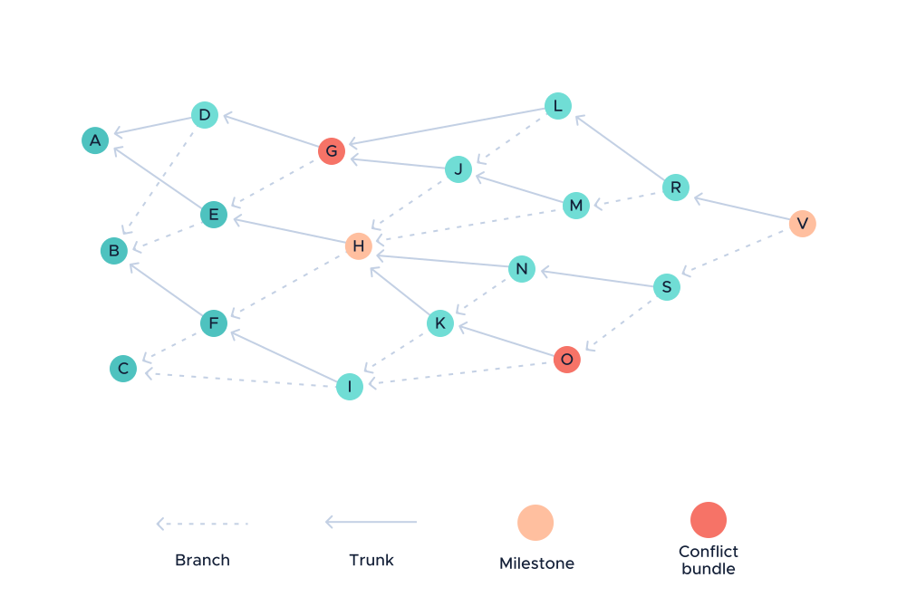
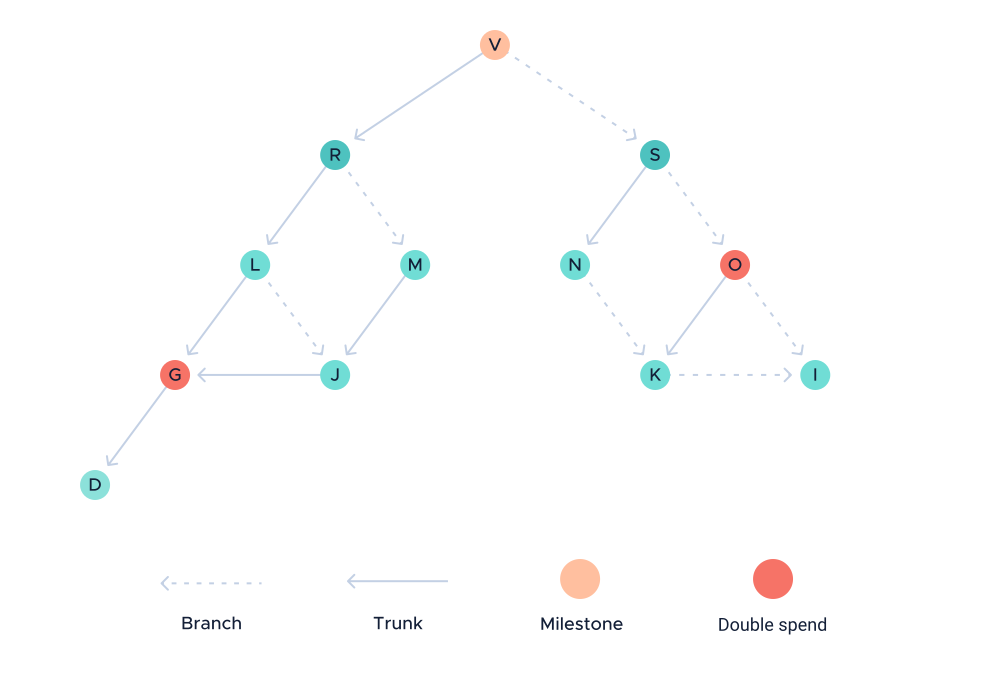

# The Coordinator

**The Coordinator is a client that sends signed transactions called milestones that nodes trust and use to confirm transactions. This topic describes how nodes use milestones to determine which transactions are confirmed.**

Transactions in the Tangle are considered for confirmation only when they are directly or indirectly referenced by a milestone that has been validated by nodes.

To allow them to recognize milestones, all nodes in the same IOTA network are configured with the [Merkle root address](../accounts/addresses.md) of a Coordinator that they trust to confirm transactions. Using this address, nodes can validate the signatures in milestones to verify whether they are signed by their trusted Coordinator.

To make sure that new transactions always have a chance of being confirmed, the Coordinator sends indexed milestones at regular intervals. This way, nodes can compare the indexes of their milestones to check whether they are synchonized with the rest of the network.


##  Sending milestones

When the Coordinator sends a milestone, it does so in the same way as any [other transaction](../first-steps/sending-transactions.md), except for the following difference:

- The [past cone](../references/glossary.md#past-cone) of the milestone's tip transactions are considered for confirmation

This past cone includes all the pending transactions that the tip transactions directly or indirectly reference. As a result, the name of this past cone is called the _confirmation cone_.

The confirmation cone of a milestone can contain two types of transaction:

- **State-mutating:** Value transactions that change the balances of two or more addresses
- **Non-state-mutating:** Zero-value transactions and value transactions that withdraw IOTA tokens from an address and deposit them straight back

Non-state-mutating transactions are always confirmed if they are referenced by a milestone.

However, state-mutating transactions can lead to [double spends](../references/glossary.md#double-spend). Therefore, nodes and the Coordinator agree on which of the transactions should be confirmed by ordering the confirmation cone.

### Ordering the confirmation cone

If the confirmation cone leads to a double spend, nodes and the Coordinator agree that the first transaction that tries to transfer the IOTA tokens should be confirmed and the others should be ignored.

However, there are many ways to order transactions in the Tangle. Therefore, nodes and the Coordinator agree to order the confirmation cone, using the following [depth-first search](https://en.wikipedia.org/wiki/Depth-first_search) that favors a path down the trunk transaction:

- Start from the milestone
- Follow the trunk transactions through the confirmation cone until the first confirmed transaction is found
- Add the closest transaction to the list
- Backtrack through the other transactions in the confirmation cone, following the same strategy that favors the trunk transaction first

For example, here are 26 transactions labeled from A to Z.



Transactions A, B, C, E, and F are confirmed by milestone H. The other transactions are the confirmation cone of milestone V, and transactions G and O represent double spends.

To order the confirmation cone, you follow the trunk all the way down to transaction D. This is the first transaction in the confirmation cone. Then, you work your way back up, finding the rest of the transactions until you have the final order.



So, starting from V, the transactions are ordered like so:

- D
- G
- J
- L
- M
- R
- I
- K
- N
- O
- S
- V

As a result, milestone V confirms transaction G because it comes before transactions O.

### Recording the confirmed transactions

To allow nodes to check which transactions in the confirmation cone are confirmed by a milestone, it includes the Merkle root of the tail transactions that it confirmed.

To create the Merkle root, the Coordinator does the following:

- Use the transaction hashes of all the chosen tail transactions as leaves

- Convert each transaction hash to 49-byte strings

- Calculate the 64-byte Merkle root

- Convert the Merkle root to 384 trits

### Constructing the bundle

After creating a Merkle root, the Coordinator is ready to add all of this information to its milestone bundle to allow nodes to validate it.

First, the Coordinator signs the bundle hash and adds the signature to the head transaction.

The length of the signature depends on the depth of the Coordinator's Merkle tree:

```
Signature length in trytes = depth x 81
```

Then, the Coordinator appends the Merkle root to the signature.

To prove its ownership of the Merkle root, the Coordinator then signs it and adds that signature to the other zero-value transactions in the milestone bundle.

## Validating milestones

To validate milestones, nodes must do the following:

- [Validate the signatures](../cryptography/merkle-tree-address.md) to make sure that the Coordinator sent the milestone
- Validate the Merkle root to make sure that the Coordinator does not confirm double spends

To validate the Merkle root, nodes follow the same depth-first search as the Coordinator.

By doing so, nodes can create their own Merkle root and compare it against the one in the milestone. If both Merkle roots match, the milestone is valid. If not, the node rejects the milestone as invalid.

## Next steps

[Learn about IOTA accounts](../accounts/overview.md) and how you can create one to prove your ownership of transactions.