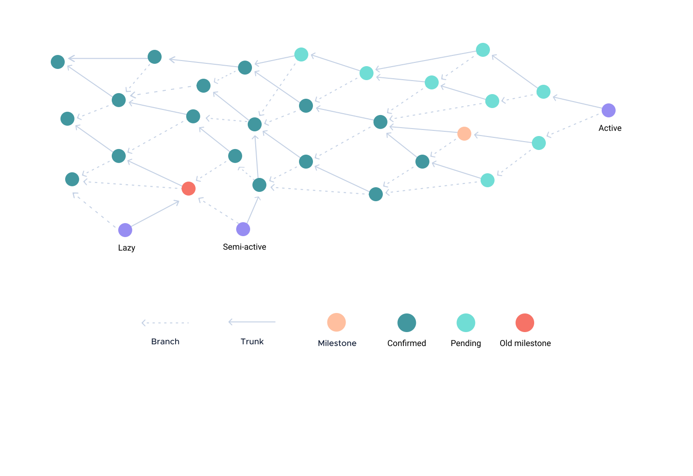

# Tip selection

**Tip selection is an algorithm that nodes use to select two tip transactions from the Tangle to maximize the confirmation rate. This topic describes why tip selection is important and how nodes select tip transactions.**

All transactions in the Tangle must be attached to two previous ones. This is [what makes transactions immutable](../the-tangle/immutability.md) and how new transactions are approved and [confirmed](../the-tangle/the-coordinator.md).

To make sure that the Tangle continues to grow, new transactions need to be attached to those that are not yet referenced by any others. These transactions are called tip transactions.

Clients are free to choose any tip transactions to attach theirs to.

However, the tip selection algorithm selects tip transactions that:

- Increase the confirmation rate
- Mitigate attacks such as [blowballs](../references/glossary.md#blowball) and [parasite chains](../references/glossary.md#parasite-chain)

## Types of tip transactions

In the Tangle, new transactions can only be confirmed if they are directly or indirectly referenced by a milestone.

As a result, the more pending transactions that are referenced by a milestone, the higher the confirmation rate.

For example, if tip 1 in this image were referenced by a milestone, lots of pending transactions would be confirmed.

If tip 2 were referenced by a milestone, no other transactions would be confirmed because its [past cone](../references/glossary.md#past-cone) includes transactions that are already confirmed by an old milestone.

Therefore, nodes categorize tip transactions into types and select only those that would lead to better confirmation rates and mitigate attacks:

|**Type**|**Can be selected**|**Description**|
|:-------|:----------|:----------|
|Non-lazy|:heavy_check_mark:|Tip transactions that are attached to a subtangle in which the latest confirmed transactions were confirmed by a recent milestone
|Semi-lazy|:heavy_check_mark:|Tip transactions whose parents are attached to a subtangle in which the latest confirmed transactions were confirmed by a recent milestone
|Lazy|:negative_squared_cross_mark:|Tip transactions that are attached to a subtangle in which the latest confirmed transactions were confirmed by an old milestone

### The difference between an old and a recent milestone

Milestone are like a clock. The more milestone ticks that happen after a transaction, the older it is.

As a result, nodes uses milestones to decide the age of a transaction.

However, what makes a transaction old is subjective. In fact, depending on the [transactions per second](../references/glossary.md#transactions-per-second) at the time you send a transaction, it may be considered old very quickly.

Therefore, all nodes in an IOTA network define old tip transactions, depending on the following:

- **Youngest transaction root snapshot index (YTRSI):** The highest [confirmation milestone index](../references/glossary.md#confirmation-milestone-index) of a transaction's [confirmed root transactions](../references/glossary.md#confirmed-root-transaction)
- **Oldest transaction root snapshot index(OTRSI):** The lowest confirmation milestone index of a transaction's confirmed root transactions

In this image, the OTRSI of the tip transaction is milestone 1 and its YTRSI is milestone 2.

If a transaction's YTRSI is too high it is lazy. If a transaction's OTRSI is too high, it is semi-lazy. Otherwise, it is non-lazy.

Nodes can define the highest YTRSI and OTRSI that they accept in their node software settings.

## Milestone tip selection

it will select the semi-lazy tangle because you "artificially" made it heavy by stitching semi-lazy tips together through spam -> making it narrower & heavier