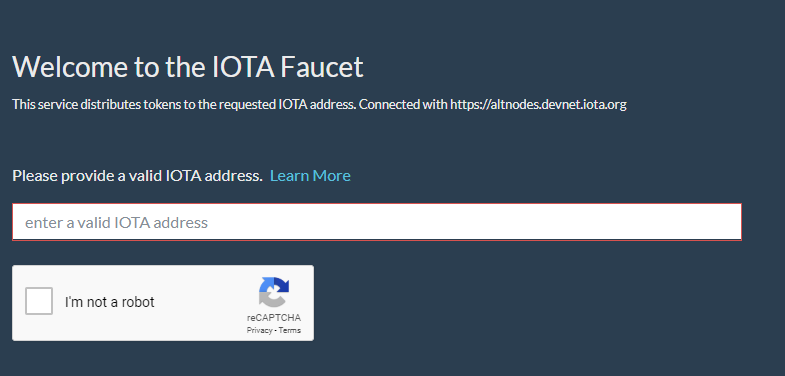

# Get test IOTA tokens

**In this tutorial, you get some test IOTA tokens that you can later transfer to your other address by sending a value transaction.**

## Prerequisites

To complete this tutorial, you need an address.

In the previous tutorial, you created two new addresses. Choose one of them to use in this tutorial.

## Transfer tokens to your address

In this step, you request some free IOTA tokens from the official Devnet faucet, which distributes tokens in batches of 1 Ki.

1. Go to [the Devnet faucet](https://faucet.devnet.iota.org/)

2. Copy and paste your address into the input field

3. Complete the [reCAPTCHA](https://en.wikipedia.org/wiki/ReCAPTCHA)

4. Click **Request**

    :::info:
    The Request button appears only if your address is valid (81 or 90 trytes long).
    :::

5. Click **Check balance**

This link takes you to a Devnet Tangle explorer, which connects to nodes in the Devnet and requests information from them about the bundle that just transferred the free tokens to your address. When the bundle is confirmed, 1 Ki will be added to the balance of your address.

:::info:These tokens are valid only in the Devnet
You can use these tokens only when you're connected to a Devnet node. Other IOTA networks have neither received nor validated the transactions that transferred the tokens to your address. As a result, they haven't updated the balance of your address.
:::

## Troubleshooting

If the Devnet faucet is not working, feel free to try the [community faucet](https://faucet.einfachiota.de/).

## Next steps

[Transfer your test tokens](../transfer-tokens/transfer-iota-tokens.md) to your other address.
