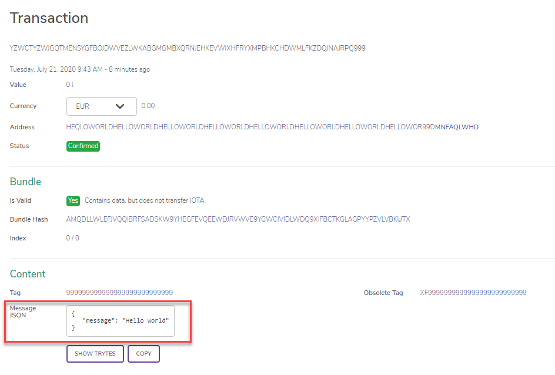

# Send a "hello world" message

**In this tutorial, you send your first message to an IOTA node. At the end of this tutorial, you'll have your own message in the Tangle that everyone can see.**

## Prerequisites

To complete this tutorial, you need a [developer environment for Node.js](../first-steps/set-up-env.md).

In this tutorial, you'll connect to a node that's run in the IOTA Foundation Devnet: A development network.

## Send a message to the node

In this step, you create a zero-value message that contains a "Hello world" message and send it to your connected node to attach to the Tangle.

1. Require the library and connect to a node

    ```js
    // Require the client library packages
    const { ClientBuilder } = require('iota-client')

    // Create a contant of the IOTA API Endpoint
    const API_ENDPOINT = "https://api.lb-0.testnet.chrysalis2.com/";

    // Create a new instance of the IOTA Client object
    // Use the `node` field to specify which node to connect to
    const client = new ClientBuilder()
        .node(API_ENDPOINT)
        .build()

    ```

2. Define an index to which you want to send a message (mind. 1 Byte, max 64 Byte)

    ```js
    const INDEX = 'MY-INDEX';
    ```

3. Define the data

    ```js
    const DATA = new TextEncoder().encode('Hello World!')
    ```
4. Send the message

    ```js
    client
        .send()
        .index(INDEX)
        .data(DATA)
        .submit()
        .then(console.log)
        .catch(console.error)

    ```

5. Execute the file

    ```bash
    node index.js
    ```

    In the console, you should see your message hash, which looks something like the following:

    ```
    bc8e493bc918639d79fca5dadb1605b97d4852a506e228ea62fd6d53a025a732
    ```

That's all!

Now see your message in the Tangle, search for your message hash in a Tangle explorer such as [explorer.iota.org](https://explorer.iota.org/chrysalis)

    Make sure to select the chrysalis network.
    
    You should see your message that you sent.
    
    


The complete script on `index.js`
```js
    // Require the client library packages
const { ClientBuilder } = require('iota-client')

// Create a contant of the IOTA API Endpoint
const API_ENDPOINT = "https://api.lb-0.testnet.chrysalis2.com/";

// Create a new instance of the IOTA Client object
// Use the `node` field to specify which node to connect to
const client = new ClientBuilder()
    .node(API_ENDPOINT)
    .build()


const INDEX = 'MY-INDEX';

const DATA = new TextEncoder().encode('Hello Tangle!')

client
    .send()
    .index(INDEX)
    .data(DATA)
    .submit()
    .then(console.log)
    .catch(console.error)
```

:::success: Congratulations :tada:
You've just sent your first message. Your message is attached to the Tangle, and will be gossiped around the rest of the network.
:::

## Next steps

Take an in-depth look at how your message made it to the Tangle by [examining the steps that were involved](../first-steps/sending-messages.md).

You can also use the client library to [search for your message in the Tangle](root://core/1.0/tutorials/js/read-transactions.md).

Examples of this tutorial are also available in the following languages:

- [C](root://core/1.0/tutorials/c/send-your-first-bundle.md)
- [Go](root://core/1.0/tutorials/go/send-your-first-bundle.md)
- [Python](root://core/1.0/tutorials/python/send-your-first-bundle.md)
- [Java](root://core/1.0/tutorials/java/send-your-first-bundle.md)
