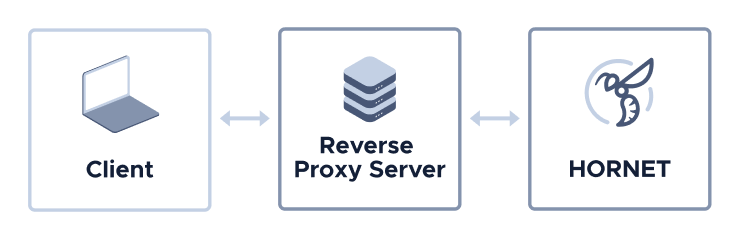

# Set a limit on requests to your node's API

**In this tutorial, you install [Nginx](https://docs.nginx.com/nginx/admin-guide/web-server/reverse-proxy/) as a reverse proxy server to limit requests to your node's API.**



## Prerequisites

To complete this tutorial, you need a Hornet node that's running on a Linux operating system.

For tutorials, see [Choose an installation method](../tutorials/install-hornet.md).

## Step 1. Install Nginx as a reverse proxy server

Nginx is a web server that can be used as a reverse proxy, load balancer, mail proxy, and HTTP cache.

In this step, you set up Nginx as a reverse proxy server to be able to manage requests to your node's API.

1. On your Linux server, open a terminal window and install Nginx

    ```bash
    sudo apt-get update
    sudo apt-get install nginx
    ```

2. Check that the Nginx server is running

    ```bash
    systemctl status nginx
    ```
    You should see something like the following in the output:

    ```shell
    nginx.service - A high performance web server and a reverse proxy server
    Loaded: loaded (/lib/systemd/system/nginx.service; enabled; vendor preset: enabled)
    Active: active (running) since Mon 2019-02-04 16:14:00 UTC; 4min 2s ago
    Main PID: 12857 (nginx)
    CGroup: /system.slice/nginx.service
            ├─12857 nginx: master process /usr/sbin/nginx -g daemon on; master_process on
            └─12858 nginx: worker process
    ```

3. Get the public IP address of your node

    ```bash
    ifconfig
    ```

    You should see something like the following:

    ```bash
    ens3: flags=4163<UP,BROADCAST,RUNNING,MULTICAST>  mtu 1500
        inet 69.89.31.226  netmask 255.255.255.0  broadcast 136.144.229.255
        inet6 fe80::5054:ff:fe6e:352c  prefixlen 64  scopeid 0x20<link>
        inet6 2a01:7c8:d005:418:5054:ff:fe6e:352c  prefixlen 64  scopeid 0x0<global>
    ```

    The `inet` field is your IP address.

    `ens3` is the network name. You may see a different network name such as `eth0`.

4. Go to a web browser and enter your IP address in the address bar

    You'll see the Nginx webpage. This page is included with Nginx to show you that the server is running. Now, you need to configure Nginx as a reverse proxy for your IRI node.

    :::info:
    If you're using a virtual private server (VPS), you may only see the default webpage of your VPS provider.
    :::

## Step 2. Limit requests to the node's API

In this step, you configure Nginx to allow only 5 API requests per second to be sent from each unique IP address.

1. Create a custom Nginx configuration file called `hornet.conf`

    ```bash
    sudo nano /etc/nginx/sites-enabled/hornet.conf
    ```

2. Add the following to the file:

    ```shell
    # Limit the amount of requests that'll be forwarded from a single IP address to the node (5 per second)
    limit_req_zone              $binary_remote_addr zone=hornet:10m rate=5r/s;

    server {

        server_name _;
        # Port that Nginx will listen on
        listen                    5000 default_server deferred;

        location / {
        # Tell Nginx to drop requests to the server if more than 5 are queued from the same IP address
        limit_req               zone=hornet burst=5 nodelay;
        
        # IP address of your node. In this case the node is running on the same machine as Nginx
        proxy_pass http://127.0.0.1:14265;
        proxy_set_header X-Real-IP $remote_addr;
        proxy_set_header X-Forwarded-For $proxy_add_x_forwarded_for;
        proxy_set_header Host $http_host;
        }
    }
    ```

3. Restart Nginx to allow the changes to take effect

    ```bash
    sudo systemctl restart nginx
    ```
    
4. Start your node, and call the `getNodeInfo` API endpoint on the Nginx port

    ```bash
    sudo apt install curl jq
    curl -s http://localhost:5000 -X POST -H 'X-IOTA-API-Version: 1' -H 'Content-Type: application/json' -d '{"command": "getNodeInfo"}' | jq
    ```

5. To test that Nginx is limiting the rate of API requests, make 20 consecutive requests to the `getNodeInfo` endpoint

    ```bash
    for i in {0..20}; do (curl  http://localhost:5000 -X POST -H 'X-IOTA-API-Version: 1' -H 'Content-Type: application/json' -d '{"command": "getNodeInfo"}') 2>/dev/null; done
    ```

    You should see a mixture of JSON responses and 503 errors, which are returned when too many requests are made from the same IP address.

    ```shell
    {"appName":"HORNET","appVersion":"0.4.0","latestMilestone":"DATHZQCGYHN9XBSEQGNIFLFWINPBGKNBEQYAUQHXVYZIEVUBPRQHAKDLQEICXDHF9BQJQOTJEYMTA9999","latestMilestoneIndex":1431701,"latestSolidSubtangleMilestone":"DATHZQCGYHN9XBSEQGNIFLFWINPBGKNBEQYAUQHXVYZIEVUBPRQHAKDLQEICXDHF9BQJQOTJEYMTA9999","latestSolidSubtangleMilestoneIndex":1431701,"isSynced":true,"milestoneStartIndex":1431349,"lastSnapshottedMilestoneIndex":1431349,"neighbors":0,"time":1591180222000,"tips":0,"transactionsToRequest":0,"features":["WereAddressesSpentFrom"],"coordinatorAddress":"EQSAUZXULTTYZCLNJNTXQTQHOMOFZERHTCGTXOLTVAHKSA9OGAZDEKECURBRIXIJWNPFCQIOVFVVXJVD9","duration":0}
    <html>
    <head><title>503 Service Temporarily Unavailable</title></head>
    <body bgcolor="white">
    <center><h1>503 Service Temporarily Unavailable</h1></center>
    <center>nginx/1.14.0 (Ubuntu)</center>
    </body>
    </html>
    ```

:::success:Congratulations! :tada:
Nginx is now controlling the requests to your node.
:::

## Next steps

At the moment, you can access the node's API only from localhost (the same computer that's running the node and Nginx). If you want to connect to your node's API from outside localhost, open port 5000.

If you want to encrypt communications between clients and your node's API, [use Nginx to add HTTPS support](../tutorials/add-https.md).