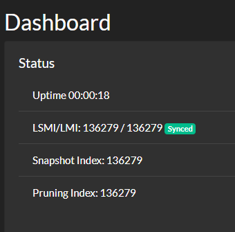

# Run a Hornet node in a Docker container

**In this tutorial, you download the Hornet Docker image and run it in a Docker container. This tutorial has been tested on [Ubuntu 18.04](http://releases.ubuntu.com/18.04).**

## Prerequisites

To complete this tutorial, you need the following:

- [Docker](https://docs.docker.com/install/#supported-platforms)
- 2 GB RAM
- A dual-core CPU
- SSD storage
- A public IP address
- Ports 15600 and 14626 must be exposed to the Internet

The amount of storage you need will depend on whether you plan on pruning transactions from your local database.

## Step 1. Download and install the node software

In this step, you download the Hornet Dockerfile and the latest snapshot data.

The latest snapshot data contains transactions from a certain point in history. By using the latest snapshot, your node will synchronize faster with the network.

1. Clone the `hornet` repository

    ```bash
    git clone https://github.com/gohornet/hornet
    cd hornet
    ```

2. Give the Docker user permission to use the database directory

    ```bash
    mkdir mainnetdb
    chown 39999:39999 mainnetdb
    ```

    :::info:
    The Docker container runs under a user with uid 39999.
    :::

3. Create a snapshot directory for each of the public IOTA networks

    ```bash
    mkdir snapshots/mainnet
    mkdir snapshots/devnet
    mkdir snapshots/comnet
    chown 39999:39999 snapshots/mainnet
    chown 39999:39999 snapshots/devnet
    chown 39999:39999 snapshots/comnet
    ```

## Step 2. Start your node

In this step, you use the Docker image to start running Hornet on the Mainnet in a Docker container.

When Hornet starts for the first time, it downloads the latest local snapshot data from https://ls.manapotion.io/, and processes it, storing the transactions in the `mainnetdb` directory.

```
2020-06-02T11:13:43+02:00       INFO    Snapshot        Downloading snapshot from https://ls.manapotion.io/export.bin
Downloading... 421 MB/685 MB (52 MB/s)2020-06-02T11:13:43+02:00       INFO    Snapshot        Downloading snapshot from https://ls.manapotion.io/export.bin
```

You have two options for running the Docker container:

- Docker Compose (easiest and quickest option)
- Build the Docker image

### Docker compose

Docker Compose is a tool for running Docker containers with a single command. For more information about Docker Compose, see the [Docker documentation](https://docs.docker.com/compose/). 

Build the Docker image and run Hornet in a container

```bash
docker-compose up -d
```

### Build the Docker image

If you don't have Docker Compose, you can build the Docker image from the Dockerfile.

1. Build the image

    ```bash
    docker build -t hornet:latest .
    ```

    :::info:
    If you're using an aarch64/arm64 architecture, pass the `--build-arg ARCH=arm64` argument to the `build` command.
    :::

2. Run Hornet in a container

    ```bash
    docker run --rm -v $(pwd)/config.json:/app/config.json:ro -v $(pwd)/latest-export.gz.bin:/app/latest-export.gz.bin:ro -v $(pwd)/mainnetdb:/app/mainnetdb --name hornet --net=host hornet:latest

    :::info:
    To make Hornet start on every reboot, add the `--restart=always` flag to the `docker run` command.
    :::

## Step 3. Check that Hornet is synchronized

A node is considered synchronized when the `latestMilestoneIndex` (LMI) field is equal to the `latestSolidSubtangleMilestoneIndex` (LSMI) field:

- `latestMilestoneIndex`: Index of the latest milestone that the IOTA node has received from its neighbors. This field is accurate only when the IOTA node is connected to synchronized neighbors.

- `latestSolidSubtangleMilestoneIndex`: Index of the latest solid milestone that's in the IOTA node's ledger

Open a web browser on the same device as your Hornet node and go to localhost:8081.



This is the Hornet dashboard.

A green icon indicates that your node is synchronized.

If your node is not synchronized, see [Troubleshooting](../references/troubleshooting.md) for help.

For more information about the dashboard, see [Setting up your dashboard](../guides/setting-up-dashboard.md).

:::success: Congratulations :tada:
You have a synchronized Hornet node.
:::

## Managing your node

This section links to the Docker documentation for information about managing your node in a Docker container.

### Displaying the log messages

See the [Docker documentation](https://docs.docker.com/engine/reference/commandline/logs/).

### Restarting Hornet

See the [Docker documentation](https://docs.docker.com/engine/reference/commandline/restart/).

### Stopping Hornet

See the [Docker documentation](https://docs.docker.com/engine/reference/commandline/stop/).

## Next steps

Try using one of the client libraries to send transactions to the nodes in your private Tangle:

- [C](root://core/1.0/getting-started/get-started-c.md)

- [Go](root://core/1.0/getting-started/get-started-go.md)

- [Java](root://core/1.0/getting-started/get-started-java.md)

- [JavaScript](root://core/1.0/getting-started/get-started-js.md)

- [Python](root://core/1.0/getting-started/get-started-python.md)

If you want to continue learning how to customize and secure your node, see the Guides section.