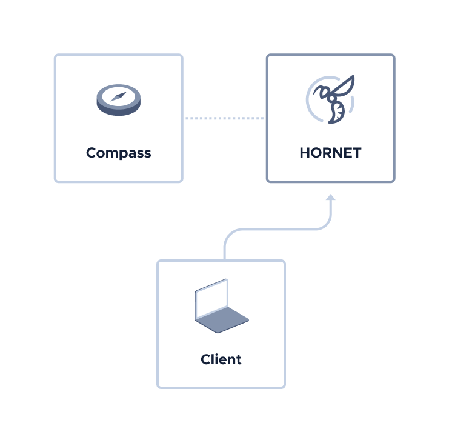
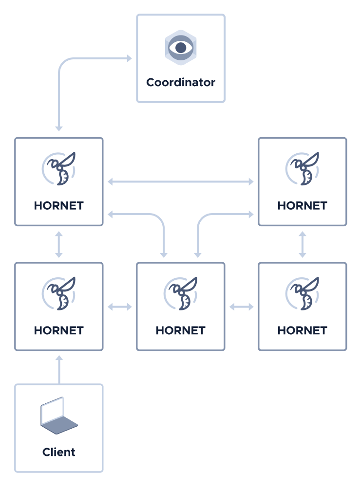

# Set up a private Tangle as a Hornet plugin

**In this tutorial, you configure your Hornet node as a private Tangle, using the `Coordinator` plugin.**



## Prerequisites

To complete this tutorial, you need a Hornet node that's running on a Linux operating system.

For tutorials, see [Choose an installation method](../tutorials/install-hornet.md). After installing your node, make a note of where your `config.json` file is. You'll need it in this tutorial.

## Step 1. Generate the Merkle tree

In this step, you generate a Merkle tree for the Coordinator plugin to use to sign milestones.

Hornet includes a tool for computing a Merkle tree signature scheme for the Coordinator plugin to use.

1. Open your `config.json` file

	The location of this file depends on how you installed Hornet.

2. Enable the plugin

	```bash
	"node":{
    "alias": "Coordinator",
    "showAliasInGetNodeInfo": false,
    "disablePlugins": [],
    "enablePlugins": ["Coordinator"]
	},
	```

3. Configure the `snapshots` object to make sure your node loads your custom snapshot file

	```bash
	"snapshots": {
    "loadType": "global",
    "global": {
        "path": "snapshot.csv",
        "spentAddressesPaths": [],
        "index": 0
    	}
	},
	```

3. Configure the `coordinator` object to customize your Coordinator instance

	```json
	"coordinator":{
    "merkleTreeDepth":16,
    "mwm":5,
    "stateFilePath":"coordinator.state",
    "merkleTreeFilePath":"coordinator.tree",
    "intervalSeconds":60,
    "checkpointTransactions":5
	},
	```

	A depth of 16 and an interval of 60 seconds allows the Coordinator to send milestones for around 45 days.

	A low minimum weight magnitude (`mwm`), makes it faster to create transactions because of the reduced proof of work.

	:::info:
    See the [Hornet configuration documentation](https://github.com/gohornet/hornet/wiki/Configuration#Coordinator) for more information.
	:::

4. Create a seed for the Coordinator plugin. The Coordinator will use this seed to derive public/private keys for the Merkle tree signature scheme.

	```bash
	cat /dev/urandom |LC_ALL=C tr -dc 'A-Z9' | fold -w 81 | head -n 1 
	```

	If you're just testing the setup, you can use this example seed. But, make sure to change it before exposing your private Tangle to the Internet.

	```bash
	PUEOTSEITFEVEWCWBTSIZM9NKRGJEIMXTULBACGFRQK9IMGICLBKW9TTEVSDQMGWKBXPVCBMMCXWMNPDX
	```

5. Create a backup of the seed

	:::danger:Keep your seed safe
	An attacker with the seed could send fraudulent milestones and disrupt the operation of the network.
	:::

6. Generate the Merkle tree. Replace the `$YOURSEED` placeholder with your seed, and the `$HORNETPATH` variable to the path where your configuration files were installed

	```bash
	sudo -u hornet COO_SEED="$YOURSEED" hornet -d $HORNETPATH tool merkle
	```

	You should see something like the following:

	```
	calculating 65536 addresses...
	calculated 5000/65536 (7.63%) addresses. 2m31s left...
	calculated 10000/65536 (15.26%) addresses. 2m15s left...
	calculated 15000/65536 (22.89%) addresses. 2m1s left...
	calculated 20000/65536 (30.52%) addresses. 1m49s left...
	calculated 25000/65536 (38.15%) addresses. 1m37s left...
	calculated 30000/65536 (45.78%) addresses. 1m25s left...
	calculated 35000/65536 (53.41%) addresses. 1m12s left...
	calculated 40000/65536 (61.04%) addresses. 1m0s left...
	calculated 45000/65536 (68.66%) addresses. 48s left...
	calculated 50000/65536 (76.29%) addresses. 37s left...
	calculated 55000/65536 (83.92%) addresses. 25s left...
	calculated 60000/65536 (91.55%) addresses. 13s left...
	calculated 65000/65536 (99.18%) addresses. 1s left...
	calculated 65536/65536 (100.00%) addresses (took 2m35s).
	calculating nodes for layer 15
	calculating nodes for layer 14
	calculating nodes for layer 13
	calculating nodes for layer 12
	calculating nodes for layer 11
	calculating nodes for layer 10
	calculating nodes for layer 9
	calculating nodes for layer 8
	calculating nodes for layer 7
	calculating nodes for layer 6
	calculating nodes for layer 5
	calculating nodes for layer 4
	calculating nodes for layer 3
	calculating nodes for layer 2
	calculating nodes for layer 1
	calculating nodes for layer 0
	merkle tree root: JVYYBXNZMGVLPYMPGAWQTZTNOPWKVEY9MWBVGNRSDLY9BLCCLIEHTEHSVVPQKFAEDOFTWLZQKEPGBUHSB
	successfully created merkle tree (took 2m35s).
	```

7. Copy the Merkle tree root from the output of the previous command

8. Open your `config.json` file

9. Paste the Merkle root into the `address` field of the `coordinator` object

	```bash
	"coordinator": {
    "address": "JVYYBXNZMGVLPYMPGAWQTZTNOPWKVEY9MWBVGNRSDLY9BLCCLIEHTEHSVVPQKFAEDOFTWLZQKEPGBUHSB",
    "securityLevel": 2,
    "merkleTreeDepth": 16,
    "mwm": 5,
    "stateFilePath": "coordinator.state",
    "merkleTreeFilePath": "coordinator.tree",
    "intervalSeconds": 60,
    "checkpointTransactions": 5
	},
	```

## Step 2. Distribute some IOTA tokens in your network

In this step, you create your snapshot file so that one of your own addresses contains the total supply of IOTA tokens.

1. Create a new seed and generate an address for it

	If you're just testing the setup, you can use this example seed. But, make sure to change this before exposing your private Tangle to the Internet.

	```bash
	GUEOTSEITFEVEWCWBTSIZM9NKRGJEIMXTULBACGFRQK9IMGICLBKW9TTEVSDQMGWKBXPVCBMMCXWMNPDX
	```

	This is the first address for this seed.

	```
	HYHSSNWMLOSRLV9ULBYTAFVQUPZLBKAGSRJOVD9X9MBELPKNMX9SWKFNYGBHQVCHLXKRIRNOAUD9MPNCW
	```

2. Create a backup of the seed

	:::danger:Keep your seed safe
	An attacker with the seed could steal all the IOTA tokens from your address.
	:::

3. In your `hornet` directory, create a new file called `snapshot.csv` and assign the total supply of IOTA tokens to your address. Replace the `$YOURADDRESS` placeholder with your own address

	```bash
	$YOURADDRESS;2779530283277761
	```

## Step 3. Run your private Tangle

In this step, you run Hornet with your new configuration so that the Coordinator plugin can start attaching milestones to your private Tangle.

1. Change into the `hornet` directory, and run Hornet. Replace the `$YOURSEED` placeholder with your seed.

	```bash
	sudo COO_SEED="$YOURSEED" -u hornet hornet --cooBootstrap
	```

	Wait until Hornet has sent at least one milestone to your node.

	You should see something like the following for each new milestone:

	```	
	2020-05-28T17:50:42+02:00       INFO    Coordinator     milestone issued (1): HTORGVDVMJSUHNDZGOTOHLRQVAISGPRTHGDZOIFWBAOKC9YSZSLQ9SXE9BXWACITIGQHCJLLXBHSJPXZ9
	2020-05-28T17:50:42+02:00       INFO    Tangle  Run solidity check for Milestone (1)...
	2020-05-28T17:50:42+02:00       INFO    Tangle  Valid milestone detected! Index: 1, Hash: HTORGVDVMJSUHNDZGOTOHLRQVAISGPRTHGDZOIFWBAOKC9YSZSLQ9SXE9BXWACITIGQHCJLLXBHSJPXZ9
	```

3. Stop Hornet (**CTRL+C**) and start it again as a service

	```bash
	sudo systemctl enable hornet.service
	sudo service hornet start
	```
 
## Step 4. Add more Hornet nodes to your private Tangle

In this step, you add more nodes to your network. The more nodes you have, the more nodes validate transactions, making your network more distributed.



1. Install another Hornet node

2. Copy the `config.json` and `snapshot.csv` files from your Coordinator node and add them to the `hornet` directory of your new node

3. In the `config.json` file of your new node, remove the Coordinator plugin

	```bash
	"node":{
    "alias": "node1",
    "showAliasInGetNodeInfo": false,
    "disablePlugins": [],
    "enablePlugins": []
	},
	```

4. Start your new node

Repeat this process for each new node that you want to add.

:::success:Congratulations :tada:
You have a private Tangle in which you own the total supply of IOTA tokens.
:::

## Next steps

Try using one of the client libraries to send transactions to the nodes in your private Tangle:

- [C](root://core/1.0/getting-started/get-started-c.md)

- [Go](root://core/1.0/getting-started/get-started-go.md)

- [Java](root://core/1.0/getting-started/get-started-java.md)

- [JavaScript](root://core/1.0/getting-started/get-started-js.md)

- [Python](root://core/1.0/getting-started/get-started-python.md)
