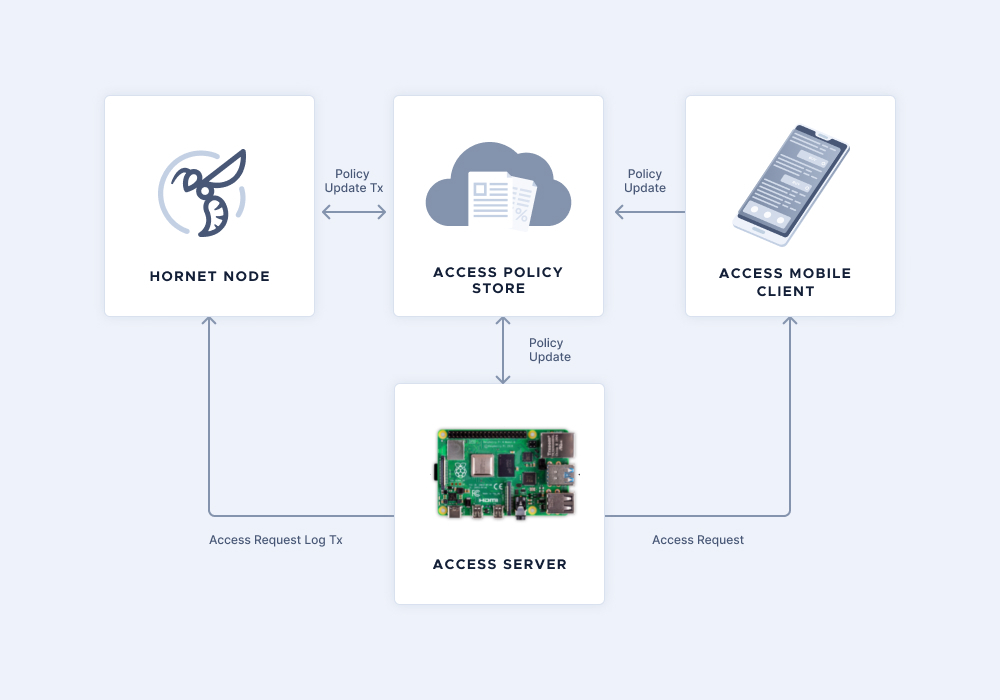
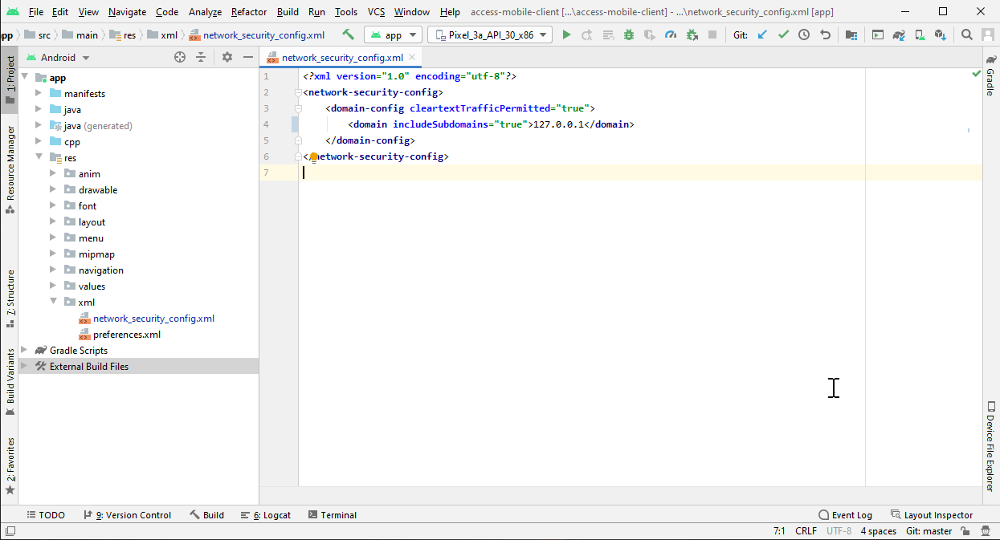
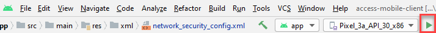
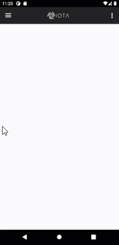
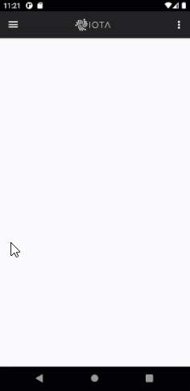

# Get started with Access on a Raspberry Pi

**In this tutorial, you learn how Access works by running a sample application that grants or denies access to functions on a Raspberry Pi.**

## Architecture



In this sample application, the Raspberry Pi runs the Access server, which accepts requests for access and checks them against policies that are stored in the Tangle by the policy store. The resource owner creates and signs policies by using the Access Mobile Client.

## Hardware

To complete this tutorial, you need the following:

- Access to a Linux server
- A Raspberry Pi 3 or 4 with a relay module

## Step 1. Run the policy store

The policy store consists of interface servers for managing policies on the Tangle. It can manage both REST and TCP requests and it communicates with IRI nodes for storing policies and local SQL database where their Tangle addresses are stored.

### Prerequisites

To run the policy store, you need the following:
- [npm](https://www.npmjs.com/get-npm)
- [Docker](https://docs.docker.com/engine/install/#server)
- [A local IRI node](root://compass/1.0/tutorials/set-up-one-command.md)

:::info:
The IRI node software is no longer supported by the public IOTA networks. Therefore, you need to [install one in a private network](root://compass/1.0/tutorials/set-up-one-command.md).

Future version of Access will allow you to connect to Hornet node software so that you can run it in a public IOTA network.
:::

---

1. Clone the project and install any dependencies

    ```bash
    git clone https://github.com/iotaledger/access-policy-store.git
    cd access-policy-store
    npm i
    ```

2. Build the project to compile it from TypeScript into JavaScript

    ```bash
    npm run build
    ```

3. Open the configuration file and add the IP address of your local IRI node to the `iri` field

    :::info:
    If your IRI node is running on the same machine as your policy store, you can leave the IP addres set to localhost (127.0.0.1).
    :::

    ```bash
    sudo nano config/default.json
    ```

    The configuration file includes the following settings:

    ```json
    {
        "server": {
            "rest": {
                "listeningPort": number
            },
            "tcp": {
                "listeningPort": number
            }
        },
        "db": {
            "host": string,
            "port": number
        },
        "iri": {
            "host": string,
            "port": number
        }
    }
    ```

    ```
    `server.rest.listeningPort`: Listening port for the REST server
    `server.tcp.listeningPort`: Listening port for the TCP server
    `db.host`: Host address for the SQL database
    `db.port`: Port number for the SQL database
    `iri.host`: URL for the IOTA node
    `iri.port`: API port number for the IOTA node
    ```

4. Create an `.env` file in the root directory and add values for the following configuration fields:

    ```bash
    SEED=
    POSTGRES_PASSWORD=
    POSTGRES_USER=
    POSTGRES_DB=
    ```

    ```
    `SEED`: Your IOTA seed for sending transactions that contain policies
    `POSTGRES_PASSWORD`: Password for the database
    `POSTGRES_USER`: Username of the database
    `POSTGRES_DB`: Name of the database
    ```

5. Start the Policy Store

    ```bash
    ./start_store.sh
    ```

6. Make sure that the containers are running

    ```bash
    docker ps
    ```

You should see something like the following:

```
CONTAINER ID        IMAGE               COMMAND                  CREATED             STATUS              PORTS                    NAMES
d60876b7c959        ps-iota-rest        "node dist/rest_serv…"   2 minutes ago       Up 2 minutes        0.0.0.0:6008->6008/tcp   ps-iota-rest
a663b0103396        ps-iota-tcp         "node dist/tcp_serve…"   2 minutes ago       Up 2 minutes        0.0.0.0:6007->6007/tcp   ps-iota-tcp
6a549bd71f67        ps-iota-db          "docker-entrypoint.s…"   2 minutes ago       Up 2 minutes        0.0.0.0:5432->5432/tcp   ps-iota-db
```

## Step 2. Run the Access server

The Access server runs on the Raspberry Pi to accept access requests from users.

The Access Server is written using the [Access Server Reference Implementation](../references/asri.md), which showcases how to put together the different pieces of the Access SDK into a functional dApp.

### Prerequisites

To run the Access server, you need a Raspberry Pi with Raspbian and an Internet connection.

---

1. Install the dependencies

    ```bash
    sudo apt-get update
    sudo apt-get install git cmake python3-distutils libfastjson-dev libcurl4-gnutls-dev libtool
    ```

2. Clone the repository

    ```bash
    git clone --recurse-submodules -j8 --branch v0.1.0-alpha https://github.com/iotaledger/access-server
    cd access-server
    ```

3. Build the project

    ```bash
    mkdir build; cd build
    cmake .. -DCMAKE_INSTALL_PREFIX=$PWD/ext_install
    make -j4
    ```

4. Add the IP address of your policy store to the `[pap]` field in the `access-server/build/config.ini` file

5. Start the Access server

    ```bash
    `sudo ./asri`
    ```

    You should see something like the following:

    ```bash
    2020-09-30 10:46:52: policy_updater:  DEBUG: [policyupdater_get_policy_list:190] device_id: 123
    ```

## Step 3. Run the Access Mobile Client

The Access Mobile Client is an Android application used to create Access policies (as device owner) and Access requests (as device user). Policies can be combined with attributes to create rules that affect resolution of the policy on the embedded device.

### Prerequisites

To run the Access Mobile Client, you need [Android Studio](https://developer.android.com/studio).

---

1. Clone the repository:
    ```
    git clone https://github.com/iotaledger/access-mobile-client.git
    cd access-mobile-client
    ```

2. Open the project in Android Studio

3. Add the IP address of your policy store to line 65 of the `app/build.gradle` file

4. Open **app** > **res** > **xml** > **network_security_config.xml** and change the domain to the IP address of your policy store

    

5. Click the **Run** button to run the Access Mobile Client in an emulator

    

6. Log into the app, using the following credentials:

    ```
    Username: Alice
    Password: IOTApass1234
    ```

7. Add the IP address of your Access server (Raspberry Pi) to the **Settings** page

    

8. Go to **Delegation editor** and create a new policy by selecting User 1 and Action 1

    

9. Refresh the home page by pulling down the page

    On the home page you should see the Action 1 button.

    In the logs of your Raspberry Pi, you should also see a message indicating that the new policy was fetched from the policy store:

    ```
    2020-09-29 18:16:07: policy_updater:  DEBUG: [policyupdater_get_policy_list:189] policy_store_version: 0xe3b0c44298fc1c149afbf4c8996fb92427ae41e4649b934ca495991b7852b855
    2020-09-29 18:16:07: policy_updater:  DEBUG: [policyupdater_get_policy_list:190] device_id: 123
    2020-09-29 18:16:12: policy_updater:   INFO: [policyupdater_get_policy:135] asking for policy E4E93F75BA560C6B0A371A9AD121B95059F6F0D45CF4325032B19E68A1AF08B5
    2020-09-29 18:16:12:  policy_loader:   INFO: [parse_policy_struct:294] Policy loaded.
    ```

10. Click the Action 1 button

    In the logs of your Raspberry Pi, you should see a message indicating that the action has been performed:

    ```
    2020-09-29 18:18:45:  policy_loader:   INFO: [pdp_calculate_decision:766] POLICY GoC RESOLVED: 1
    2020-09-29 18:18:45:  policy_loader:   INFO: [pdp_calculate_decision:767] POLICY DoC RESOLVED: 0
    2020-09-29 18:18:45:  policy_loader:   INFO: [pdp_calculate_decision:768] POLICY RESOLVED: 1
    2020-09-29 18:18:45:  plugin:   INFO: [action_cb:101] Action performed: action#1	
    2020-09-29 18:18:45:  plugin:   INFO: [print_terminal:81] Printing from PEP plugin as part of Action: action#1
    ```

:::success:Congratulations :tada:
You've set up your own Access architecture that allows you to give access to functions on a Raspberry Pi and invoke those actions, using a mobile app.
:::

## Troubleshooting

This section helps you to resolve errors that may occur when following this tutorial.

### Error starting Network actor

You may see this error when you stop the Access server and then try and run it again with the `./asri` command.

Wait one or two minutes for your operating system to clean the remaining threads, then try and run the command again.

## Next steps

Learn more details about Access in the [specifications](../references/auth-specs.md).